```{r xaringan-themer, include=FALSE, warning=FALSE}
#This block contains the theme configuration for the CSS lab slides style
library(xaringanthemer)
library(showtext)
style_mono_accent(
  base_color = "#5c5c5c",
  text_font_size = "1.5rem",
  header_font_google = google_font("Arial"),
  text_font_google   = google_font("Arial", "300", "300i"),
  code_font_google   = google_font("Fira Mono")
)
```

```{r setup, include=FALSE}
options(htmltools.dir.version = FALSE)
```

layout: true

<div class="my-footer"><span>David Garcia - Computational Modelling of Social Systems</span></div> 

---

# Recap: The macro-micro gap

```{r, echo=FALSE, out.width=900, fig.align='center'}
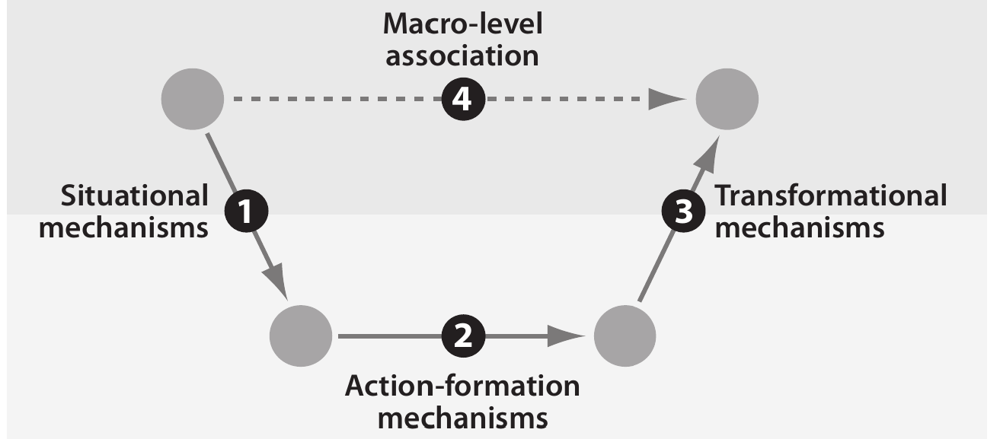
```

*Causal Mechanisms in the Social Sciences. Peter Hedström and Petri Ylikoski. Annual Review of Sociology, 2010.*

---

# Recap: Agent-Based Modelling (ABM)

- Agent-Based Modelling: A computational analogy of a social system that is composed of a set of agents that represent *discrete* individuals

- Agents have internal states, perceive the actions of other agents, and interact with other agents and their environment (*situated*)

- Agents are *active*: they have a behavioral repertoire, are not just particles

- Agents might have access only to *limited informtion* in their environment

- Agents might have *internal goals* that determine their behavior and can *adapt* to the behavior of other agents or the environment

*Agent-Based Modeling: A New Approach for Theory Building in Social Psychology. Eliot Smith and Frederica Conrey, 2007*

---

# Overview

## 1. Segregation

## 2. Schelling's segregation model

## 3. Analyzing Schelling's model

## 4. Cellular Automata: The game of life

---

# Segregation

## *1. Segregation*

## 2. Schelling's segregation model

## 3. Analyzing Schelling's model

## 4. Cellular Automata: The game of life


---

# Urban segregation: definition

Urban segregation is the unequal distribution of different social groups in the urban space, based mainly on occupation, income and education, as well as on gender and ethnicity. -- [The Future of Cities. European Research Comission](https://urban.jrc.ec.europa.eu/thefutureofcities/social-segregation#the-chapter)

```{r, echo=FALSE, out.width=1000, fig.align='center'}
knitr::include_graphics("Figures/Berlin.jpeg")
```

---

## Segregation example: District of Columbia, US

```{r, echo=FALSE, out.width=950, fig.align='center'}
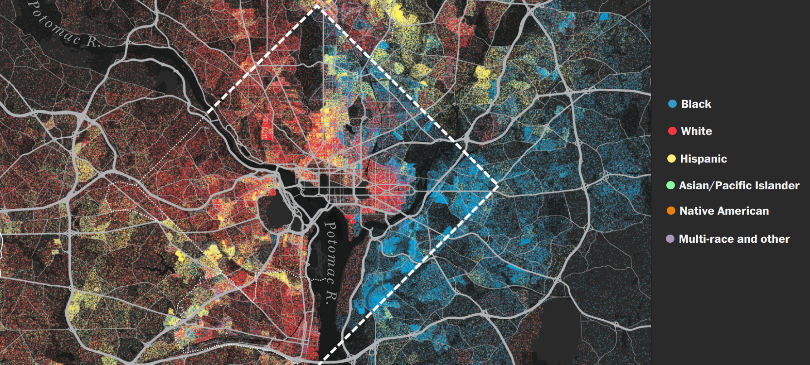
```

[America is more diverse than ever — but still segregated. The Washington Post](https://www.washingtonpost.com/graphics/2018/national/segregation-us-cities/)

---

## Segregation example: Yaffo, Israel

.pull-left[
```{r, echo=FALSE, out.width=430, fig.align='center'}
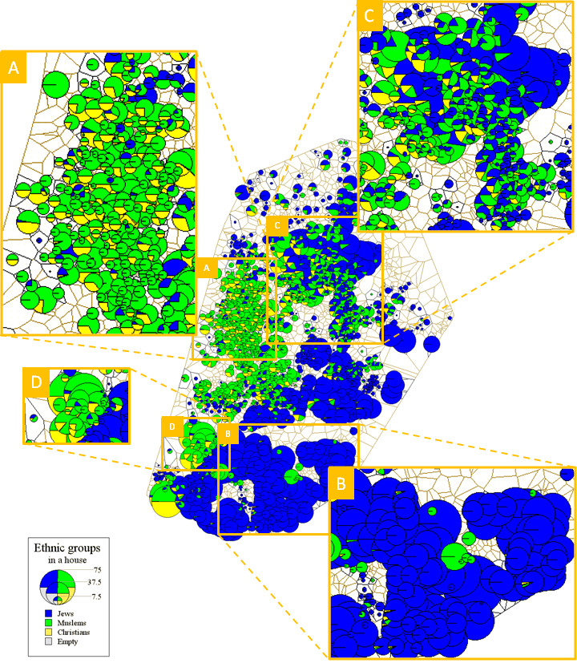
```
]

.pull-right[

- Neighborhood units with shares of ethnic groups as pie charts

- Share of Jewish, Muslim, and Christian inhabitants

- Segregation: Jewish vs non-jewish areas

- Observation: some areas are less segregated (area C)


[Hatna & Benenson. JASSS, 2012](https://www.jasss.org/15/1/6.html)


]

---

# Residential segregation persistence

```{r, echo=FALSE, out.width=800, fig.align='center'}
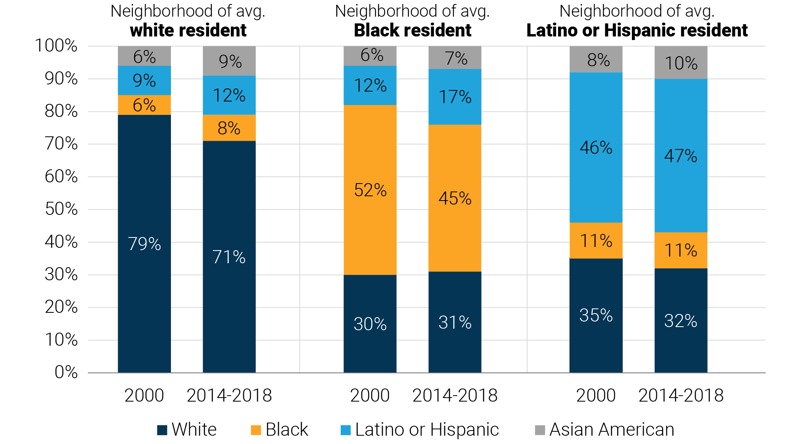
```

[The Great Real Estate Reset. Loh, Coes, & Buthe, 2020](https://www.brookings.edu/essay/trend-1-separate-and-unequal-neighborhoods-are-sustaining-racial-and-economic-injustice-in-the-us/)

---

# Increasing income segregation

```{r, echo=FALSE, out.width=650, fig.align='center'}
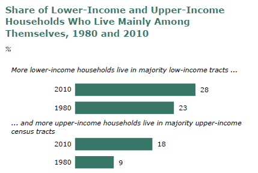
```

[The Rise of Residential Segregation by Income. Pew Research Center.](https://www.pewresearch.org/social-trends/2012/08/01/the-rise-of-residential-segregation-by-income/)

---

# ZIP code at birth predicts life outcomes

```{r, echo=FALSE, out.width=900, fig.align='center'}
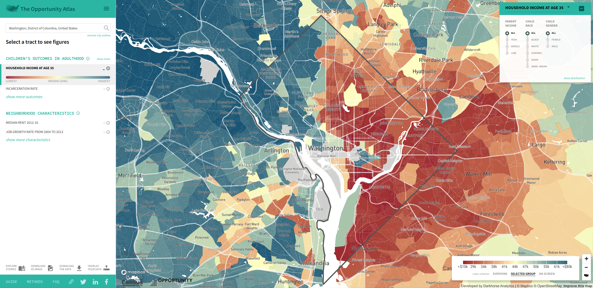
```

https://www.opportunityatlas.org/

---

## Questions about the origin of segregation

- Top-down segregation: Discriminatory policies

- Bottom-up segregation: Individual location choices influenced by:
  - Price of housing and services
  - Access to religious centers and education in a language
  - Tenant exclusion and bias
  
- What is the role of inhabitant intolerance to different neighbors?

- Without central discrimination, can segregation emerge even when individuals tolerate living in a neighborhood in which they are in the minority?

---

# Schelling's segregation model

## 1. Segregation

## *2. Schelling's segregation model*

## 3. Analyzing Schelling's model

## 4. Cellular Automata: The game of life

---

# Schelling's model setup

.pull-left[
```{r, echo=FALSE, out.width=500, fig.align='center'}
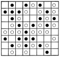
```
]

.pull-right[

- Agents of two kinds, similar number (here 22 and 23)
- Low but nonzero fraction of empty cells (here 19)
- Cells have a neighborhood of 8 cells (3x3 - 1)
- Border and corner cells have smaller neighborhood
- Agents are aware of the fraction of similar agents in their neighborhood: $f$
- Agents are satisfied with $f \geq F$
- $F$ measures intolerance

]
---

# Relocation example

.pull-left[
```{r, echo=FALSE, out.width=500, fig.align='center'}
knitr::include_graphics("Figures/Schelling2.svg")
```
]
.pull-right[
-  $F=0.35$ 

- 3/3 neighbors are equal: 
  - agent stays

- Remember:
  - Only occupied neighbor cells count
  - Cells close to the border have smaller neighborhoods
]
---

# Relocation example

.pull-left[
```{r, echo=FALSE, out.width=500, fig.align='center'}
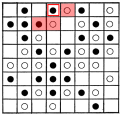
```
]
.pull-right[
-  $F=0.35$ 

- 1/3 neighbors are equal:
  - 1/3 < 0.35
  - agent marked for relocation
]

---

# Relocation example

.pull-left[
```{r, echo=FALSE, out.width=500, fig.align='center'}
knitr::include_graphics("Figures/Schelling4.svg")
```
]
.pull-right[
-  $F=0.35$ 

- 2/4 neighbors are equal:
  - 0.5 > 0.35
  - agent stays
]

---


# Relocation example

.pull-left[
```{r, echo=FALSE, out.width=500, fig.align='center'}
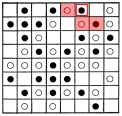
```
]
.pull-right[
-  $F=0.35$ 

- 1/3 neighbors are equal:
  - 1/3 < 0.35
  - agent marked for relocation
]

---

# Relocation example

.pull-left[
```{r, echo=FALSE, out.width=500, fig.align='center'}
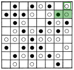
```
]
.pull-right[
-  $F=0.35$ 

- 1/2 neighbors are equal:
  - 0.5 > 0.35
  - agent stays

- Note:
  - Corner cells have at most three neighbors
]

---


# Relocation example

.pull-left[
```{r, echo=FALSE, out.width=500, fig.align='center'}
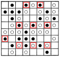
```
]
.pull-right[
- "Unhappy" agents with $f<F$

- Relocation based on a sequence and a rule where to jump


- Some variablity in this step:
  - Random sequence or ordered
  - Allowing random jumps with a low probability (e.g. 1%)


- Options about jumps:  
a) closest happy free spot  
b) happiest free spot: $max(f)$, even if new $f$ still below $F$
]
---

# Simulation result

.pull-left[
```{r, echo=FALSE, out.width=500, fig.align='center'}
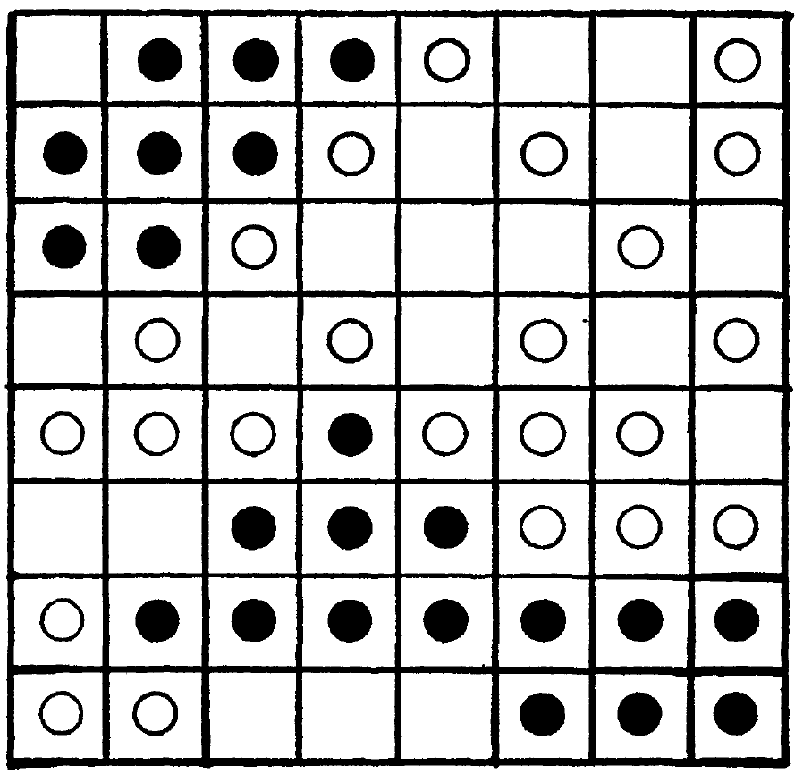
```
]
.pull-right[

- State after running a few iterations

- All agents are satisfied ( $f \geq F$ )

- No more relocations take place (simulation ends)

- Result looks segregated 
  - Two large black regions
  - Rest formed by scattered white agents
]

---

# Simulation configuration

.pull-left[
```{r, echo=FALSE, out.width=450, fig.align='center'}
knitr::include_graphics("Figures/RND.png")
```
]

.pull-right[
```{r, echo=FALSE, out.width=450, fig.align='center'}
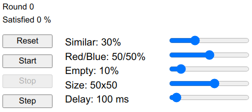
```

http://nifty.stanford.edu/2014/mccown-schelling-model-segregation/

- Random initial configuration
- Parameters can be changed
- Reporting % satisfied agents and simulation round

]

---


# Low intolerance case

.pull-left[
```{r, echo=FALSE, out.width=450, fig.align='center'}
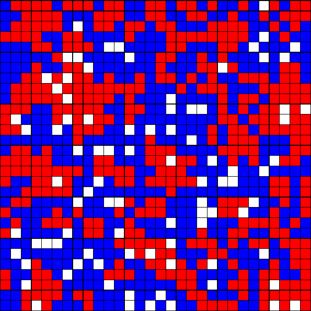
```
]

.pull-right[

- $F=0.2$

- Result very similar to initial configuration

- No apparent segregation

- All agents satisfied soon

]

---


# High intolerance case

.pull-left[
```{r, echo=FALSE, out.width=450, fig.align='center'}
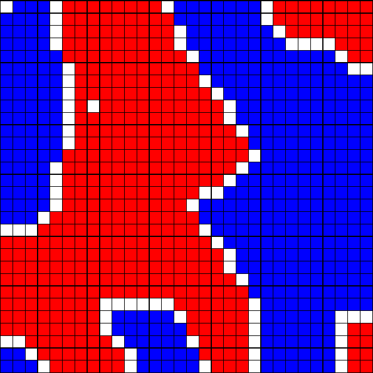
```
]

.pull-right[

- $F=0.6$

- Result is very segregated

- Empty cells form borders between clusters

- Several iterations are necessary for all agents to be satisfied

]

---


# 0.5 intolerance case

.pull-left[
```{r, echo=FALSE, out.width=450, fig.align='center'}
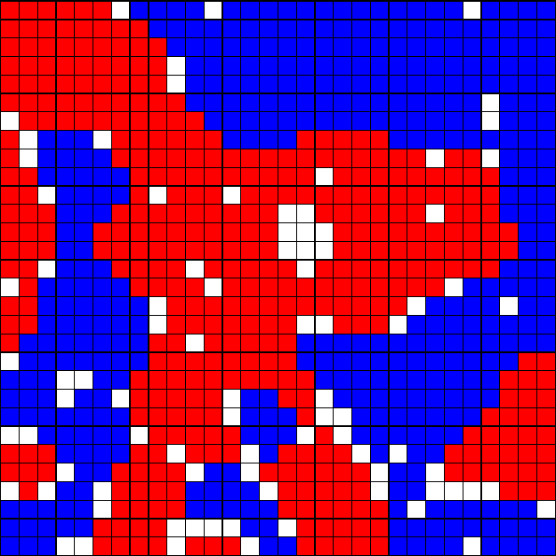
```
]

.pull-right[

- $F=0.5$

- Result is substantially segregated

- Empty cells form borders between clusters

- Several iterations are necessary for all agents to be satisfied

]

---


# 0.4 intolerance case

.pull-left[
```{r, echo=FALSE, out.width=450, fig.align='center'}
knitr::include_graphics("Figures/40.png")
```
]

.pull-right[

- $F=0.4$

- Result is also segregated

- **Agents are OK living in minority!**

- All agents can be satisfied


]

---


# Analyzing Schelling's model

## 1. Segregation

## 2. Schelling's segregation model

## *3. Analyzing Schelling's model*

## 4. Cellular Automata: The game of life

---

# Measuring segregation: Moran's I


$$\Large I = \frac{M \sum_i \sum_j w_{i,j} (x_i - \bar x) (x_j - \bar x)}{(\sum_i \sum_j w_{i,j}) \sum_i (x_i-\bar x)^2}$$

- $M$: Number of occupied cells
- $w_{i,j}$: adjacency matrix of cells
  - $w_{i,j}=1$ if $i$ is a neighbor of $j$, otherwise $w_{i,j}=0$ 
- $x_i$: color value of occupied cell $i$
  - $x_i=1$ if blue agent in it, $x_i=0$ if red agent in it
  - We only count over occupied cells, ignore empty ones
- $\bar x$: mean value of $x$, i.e. fraction of blue agents
- Also known as spatial autocorrelation
---

# How to calculate Moran's I

We rewrite I as $\Large I = \frac{M C}{W \sigma}$, where:

$$C = \sum_i \sum_j w_{i,j} (x_i - \bar x) (x_j - \bar x)$$
$$W = \sum_i \sum_j w_{i,j}$$

$$\sigma =  \sum_i (x_i-\bar x)^2$$
With a loop over the cells, we can iteratively calculate $C$, $W$, and $\sigma$

---

# Moran's I example

.pull-left[
```{r, echo=FALSE, out.width=450, fig.align='center'}
knitr::include_graphics("Figures/Moran1.svg")
```
]

.pull-right[
- Example: 9 cells

- 3x3 neighborhood

- 4 red and 4 blue agents

  - $x_i=0$ if i occupied by blue

  - $x_i=1$ if i occupied by red

  - $\bar x = 0.5$

  - $M=8$
]

---

# Moran's I example

.pull-left[
```{r, echo=FALSE, out.width=450, fig.align='center'}
knitr::include_graphics("Figures/Moran2.svg")
```
]

.pull-right[

- First cell: blue  ( $x_1=0$ )

- Contribution to $\sigma$:

$$\sigma \leftarrow \sigma + (x_i-\bar x)^2 \leftarrow \sigma + (0-0.5)^2$$
- Contribution to $W$: 2 neighbors

$$M \leftarrow M + 2$$
- Empty neighborhood cell doesn't count!

]

---

# Moran's I example

.pull-left[
```{r, echo=FALSE, out.width=450, fig.align='center'}

```
]

.pull-right[

- First neighbor (cell 2):  
contribution to C

$$ C \leftarrow C + w_{1,2} (x_1 - \bar x) (x_2 - \bar x)$$

- Because cells 1 and 2 are neighbors, $w_{1,2}=1$

$$ C \leftarrow C + 1(0 - 0.5)(1 - 0.5) $$

$$ C \leftarrow C - 0.25 $$
- Different neighbors reduce $I$

]


---


# Moran's I example

.pull-left[
```{r, echo=FALSE, out.width=450, fig.align='center'}
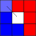
```
]

.pull-right[

- Second neighbor (cell 5)

- Does not contribute to C because it is empty

]

---


# Moran's I example

.pull-left[
```{r, echo=FALSE, out.width=450, fig.align='center'}

```
]

.pull-right[

- First neighbor (cell 4):  
contribution to C

$$ C \leftarrow C + w_{1,4} (x_1 - \bar x) (x_4 - \bar x)$$

- Because cells 1 and 4 are neighbors, $w_{1,4}=1$

$$ C \leftarrow C + 1(0 - 0.5)(0 - 0.5) $$

$$ C \leftarrow C + 0.25 $$
- Equal neighbors increase $I$

]

---


# Moran's I example

.pull-left[
```{r, echo=FALSE, out.width=450, fig.align='center'}
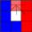
```
]

.pull-right[

- Second cell: red  ( $x_2=1$ )

- Contribution to $\sigma$ and M

$$\sigma \leftarrow \sigma + (x_i-\bar x)^2 \leftarrow \sigma + (1-0.5)^2$$
$$M \leftarrow M + 4$$
- Four contributions to $C$:


$$ C \leftarrow C + 0.25 + 0.25 - 0.25 -  0.25$$

]

---


# Moran's I example

.pull-left[
```{r, echo=FALSE, out.width=450, fig.align='center'}
knitr::include_graphics("Figures/Moran1.svg")
```
]

.pull-right[

$$M = 8$$
$$C = 16*0.25-8*0.25=2$$
$$W = 24$$

$$\sigma = 0.25*8=2$$

$$\Large I = \frac{M C}{W \sigma} = \frac{8*2}{24*2}=0.3$$


]

---

# Maximum Moran's I example

.pull-left[
```{r, echo=FALSE, out.width=450, fig.align='center'}
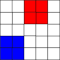
```
]

.pull-right[

$$M = 8$$
$$C = 24*0.25=6$$
$$W = 24$$

$$\sigma = 0.25*8=2$$

$$\Large I = \frac{M C}{W \sigma} = \frac{8*6}{24*2}=1$$


]

---


# Segregation versus tolerance

.pull-left[
```{r, echo=FALSE, out.width=750, fig.align='center'}
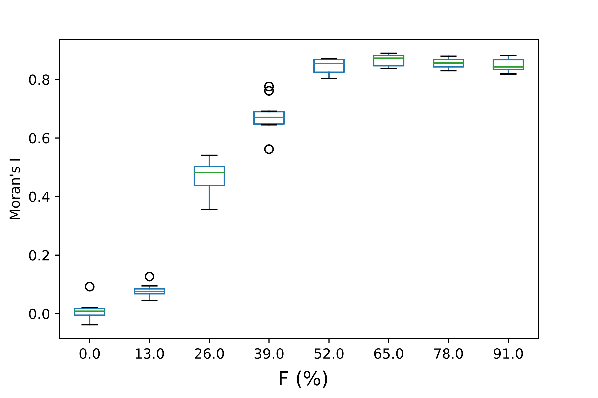
```
]
.pull-right[

- 9x9 neighborhood (up to 8 neighbors), torus edges

- Boxplots of I after convergence in several simulations

- Moran's I stays low for low F values

- Sharp increase above two neighbors for F

- Substantial segregation for F>0.33

]
---

# Generalizing relocation rules

```{r, echo=FALSE, out.width=1000, fig.align='center'}
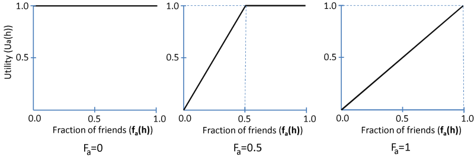
```

- Modeling the utility of an agent under with certain fraction of similar agents
- Probability to relocate every iteration: 1 - utility
- Happiness is measured as total utility

---

## Coexistence between segregation and mixtures

```{r, echo=FALSE, out.width=900, fig.align='center'}
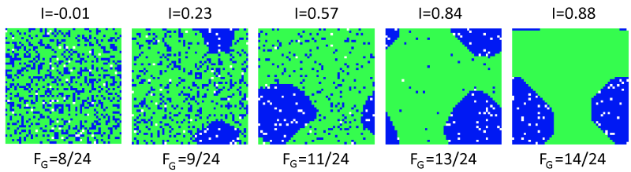
```

- Generalization of model: different number of agents per color and different thresholds for each color
- Model reproduces observed clusters of one group with mixed regions

[The Schelling Model of Ethnic Residential Dynamics: Beyond the Integrated - Segregated Dichotomy of Patterns. Erez Hatna and Itzhak Benenson. Journal of Artificial Societies and Social Simulation, 2012](https://www.jasss.org/15/1/6.html)


---

# Cellular Automata: The game of life

## 1. Segregation

## 2. Schelling's segregation model

## 3. Analyzing Schelling's model

## *4. Cellular Automata: The game of life*

---

# Cellular Automata

- agents $\equiv$ cells, arranged on a predefined lattice
- formal structure of Cellular Automata
  - finite or infinite grid of identical cells $i=1,...,L$
  - cell with internal state $\theta_{i} (t) \in \{\theta_1,\dots, \theta_n \}$
  - neighborhood configuration: $\beta_{i}(t)\in\{\beta_1,\ldots,\beta_m\}$ 
  - discrete dynamics for the state variable at $t+1$ :
    $$\theta_{i}(t+1)=\mathbf{F}\left[\underline{\theta}(t),\underline{\beta}(t)\right]$$
- characteristics: 
  - discrete space, time, and states
  - same transition rule applies to all cells
  - *each* cell is an agent (!)

---


# Cellspace and Neighbourhoods
- Many types of neighbourhoods possible.
- Examples in 2D:
```{r, echo=FALSE, out.width=800, fig.align='center'}
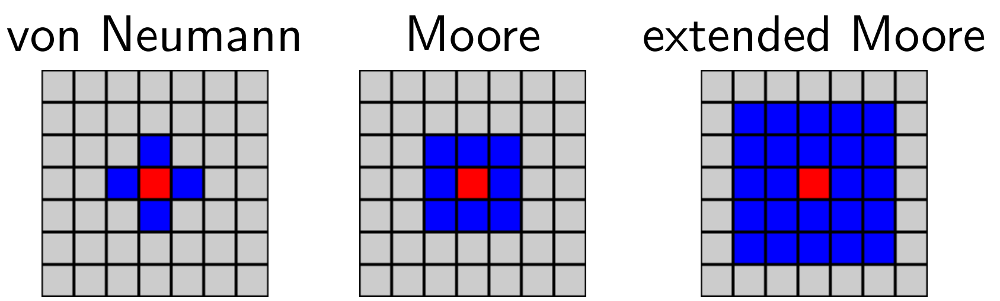
```
- Finite cellspace L $\rightarrow$ border cells need different update rule
  - option 1: mirror border cells 
  - option 2: periodic boundary condition: A Torus
- Not only squares, but also triangular, hexagonal and even irregular tilings possible (e.g. Voronoi tesselations)

---

# Conway's Game of Life

- History
  - **John Conway** (1970): design a self-replicating system 
  - 2010: first self-replicating structure in *Life*, called *Gemini*
  - 2013: first replicator that creates a bigger copy of itself (self-similarity)
- Rules of the Game
  - 2D rectangular infinite grid with "dead" and "alive" cells
  - a dead cell becomes alive if 3 neighbours are alive - **reproduction**
  - an alive cell dies if less than 2 neighbours are alive - **underpopulation**
  - an alive cell dies if more than 3 neighbours  are alive - **overcrowding**
- Importance of Conway's Game of Life
  - complex behaviour emerges from simple rules for agents
  - early modeling of self-organization

To play the game: https://playgameoflife.com

---

#Simulating the Game of Life

Dead cells are white, alive cells are black: 

```{r, echo=FALSE, out.width=800, fig.align='center'}
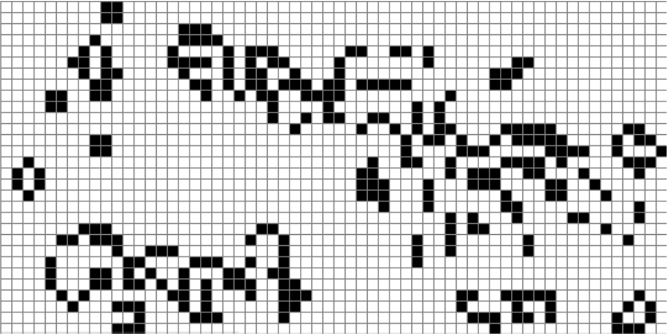
```


---
background-image: url(Figures/GolEx.svg)
background-size: 98%
#Evolution of structures

- still lifes: static patterns (e.g. 'beehive')

- oscillators: repeating patterns

- spaceships: translating patterns (e.g. 'glider')

- guns: stationary patterns which emit spaceships

- puffers: translating patterns which leave a trail of debris behind

- the Gemini replicator: http://youtu.be/A8B5MbHPlH0
 
A whole library of structures is available at https://playgameoflife.com/lexicon

You can even setup Game of Life in the Game of life: http://youtu.be/xP5-iIeKXE8

---

# Summary

- Residential segregation: could it emerge without resource limits or central discrimination/laws?

- Schelling's model of segregation: agents in a lattice that relocate when their neighborhood similarity is below a threshold [(Schelling, 1971)](https://www.uzh.ch/cmsssl/suz/dam/jcr:00000000-68cb-72db-ffff-ffffff8071db/04.02%7B_%7Dschelling%7B_%7D71.pdf)

- Analyzing Schelling's model: Moran's I and iteration over F values
  - Segregation emerges below 0.5, as low as 0.33
[(Hatna &  Benenson, 2012)](https://www.jasss.org/15/1/6.html)

- Other models on lattices: Cellular automata. Conway's Game of Life as one of the first examples of emergence of complex behavior from simple rules
[(Gardner, 1970)](https://web.stanford.edu/class/sts145/Library/life.pdf)


---

# Quiz

- Is there residential segregation in Graz? If so, on what attributes?

- What other contexts can have segregation besides the residential case?

- With F=0.35 and 8x8, is there a possible state in which 60 agents are happy?

- What are the simplifications of Schelling's model?

- How can we take into account weaker correlations at distance larger than 1 in Moran's I?

- How is Schelling's model different to the formulation of cellular automata?

- Do you know any other cellular automata besides the game of life?


