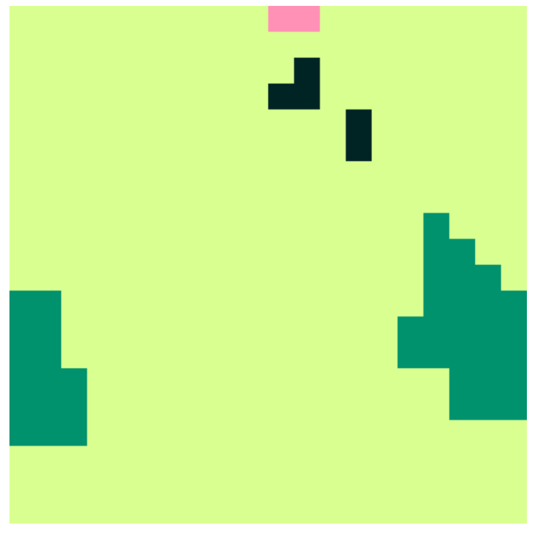

```{r xaringan-themer, include=FALSE, warning=FALSE}
#This block contains the theme configuration for the CSS lab slides style
library(xaringanthemer)
library(showtext)
style_mono_accent(
  base_color = "#5c5c5c",
  text_font_size = "1.5rem",
  header_font_google = google_font("Arial"),
  text_font_google   = google_font("Arial", "300", "300i"),
  code_font_google   = google_font("Fira Mono")
)
```

```{r setup, include=FALSE}
options(htmltools.dir.version = FALSE)
```

layout: true

<div class="my-footer"><span>David Garcia - Computational Modelling of Social Systems</span></div> 

---

# Recap: The macro-micro gap

```{r, echo=FALSE, out.width=900, fig.align='center'}
knitr::include_graphics("Figures/Boat.png")
```

*Causal Mechanisms in the Social Sciences. Peter Hedström and Petri Ylikoski. Annual Review of Sociology, 2010.*

---

# Recap: Schelling's Segregation Model

.pull-left[

```{r, echo=FALSE, out.width=350, fig.align='center'}
knitr::include_graphics("Figures/40.png")
```

]
.pull-right[

```{r, echo=FALSE, out.width=900, fig.align='center'}
knitr::include_graphics("Figures/IvsF.png")
```

]


- [Dynamic Models of Segregation. Thomas Schelling. Journal of Mathematical Sociology, 1971](https://www.uzh.ch/cmsssl/suz/dam/jcr:00000000-68cb-72db-ffff-ffffff8071db/04.02%7B_%7Dschelling%7B_%7D71.pdf)
---

# Overview

## 1. Measuring culture

## 2. Axelrod's culture model

## 3. Analyzing Axelrod's model

## 4. Empirical analysis of culture dynamics

---


# Measuring culture

## *1. Measuring culture*

## 2. Axelrod's culture model

## 3. Analyzing Axelrod's model

## 4. Empirical analysis of culture dynamics

---

# Cultural values and norms


"Culture is the collective programming of the mind that distinguishes the members of one group or
category of people from others" - Geert Hofstede

[Dimensionalizing Cultures: The Hofstede Model in Context (2011)](http://mchmielecki.pbworks.com/w/file/fetch/64591689/hofstede_dobre.pdf)

For example:

- Shared values and beliefs: tolerance of suicide, gender equality at home, importance of individual versus nation, strength of authority

- Artistic and symbolic norms: popular and folk music, dressing style, food consumption differences, literature genres

- Customs and other norms: walking speed, gender segregation norms, tolerance to nudity, public displays of affection or bodily functions


---

# Work cultures: Hofstede's model

Model based on questionnaires of IBM workers around the world: captures cultural differences but is incomplete.

- **Power distance:** Norm of acceptance that power is distributed unequally

- **Individualism - collectivism:** Degree of interdependence among members of a society

- **Masculinity:** Society is driven by competition and achievement or by well-being and care for others

- **Uncertainty avoidance:** the extent to which people feel threatened by ambiguous or unknown situations and try to avoid these


---

# Work cultures: Hofstede's model


```{r, echo=FALSE, out.width=800, fig.align='center'}
knitr::include_graphics("Figures/Hofstede.png")
```

https://www.hofstede-insights.com/product/compare-countries/
---

# World Values: Schwartz's model

.pull-left[
```{r, echo=FALSE, out.width=450, fig.align='center'}

```
]

.pull-right[

- Theoretical formulation of the basic shared values that differentiate cultures

- Measurable through survey questionnaires

- Organized in larger dimensions

- Basis of World Values Survey

[An Overview of the Schwartz Theory of Basic Values (2012)](https://www.researchgate.net/profile/Shalom-Schwartz/publication/271231569_An_Overview_of_the_Schwartz_Theory_of_Basic_Values/links/54cba1430cf24601c0881058/An-Overview-of-the-Schwartz-Theory-of-Basic-Values.pdf)

]


---

# The Ingelhart-Welzel map

.pull-left[

- Factor analysis of World Values Survey

- Two factors explain ~70% of variance:
  - Traditional-Secular values
  - Survival-Self expression values
  
- Clustering based on cultural history
  
[The WVS Cultural Map of the World, Inglehart & Welzel (2010) ](https://web.archive.org/web/20131019112321/http://www.worldvaluessurvey.org/wvs/articles/folder_published/article_base_54)

]
.pull-right[
```{r, echo=FALSE, out.width=480, fig.align='center'}

```
]

---


# Axelrod's culture model

## 1. Measuring culture

## *2. Axelrod's culture model*

## 3. Analyzing Axelrod's model

## 4. Empirical analysis of culture dynamics

---

# Questions about cultural dynamics

.pull-left[
- Cultures influence each other, sometimes forcefully and sometimes willingly. 

- Why do different cultures persist under the presence of this kind of convergence dynamics? Is differentiation necessary?

- What is the role of diversity of cultural options, number of cultural features, and physical space in the coexistence of cultures?
]
.pull-right[
```{r, echo=FALSE, out.width=550, fig.align='center'}

```
]

---

# Cultural vectors in Axelrod's model

.pull-left[

- Cultures are composed of a vector of $F$ features
- Each feature can have a distinct value out of $k$ possible traits
- Traits can only be equal or different (0/1 similarity)


- Features can be language, shared values, display norms, food...
- Traits are the possible values of the feature and can be copied

]

.pull-right[
```{r, echo=FALSE, out.width=700, fig.align='center'}

```
]


- [The Dissemination of Culture: A Model with Local Convergence and Global Polarization. Robert Axelrod, Journal of Conflict Resolution 41(20), 1997](https://journals.sagepub.com/doi/pdf/10.1177/0022002797041002001)
---

# Cultural similarity in Axelrod's model

.pull-left[

- Cultural similarity is calculated as fraction of features with the same trait over total number of features:

$$sim(u,v) =  \sum_i \delta(u_i, v_i) / F$$
- $u$ and $v$ are two cultures with cultural vectors $u_i$ and $v_i$

- $\delta(x,y)=1$ if and only if $x=y$

- $F$ is the number of features
]

.pull-right[
```{r, echo=FALSE, out.width=700, fig.align='center'}

```
$$sim(u,v)=2/5$$
]
---

# Grid space in Axelrod's model


.pull-left[

- Model is a cellular automaton in a 2D grid

- Von-Neumann neighbourhood: four neighbors in a cross

- Visualization shows similarity as edges between cells: lighter is more similar

- Example: 10x10, $F=5$, $k=10$

]

.pull-right[
```{r, echo=FALSE, out.width=450, fig.align='center'}

```
]
---


# Model dynamics

1. Choose a cell (agent) uniformly at random to be the active agent

2. Choose at random one of its neighbors

3. With probability equal to their cultural similarity:
  
  - Active agent copies a random feature of its neighbor in which they differed

Notes:
- Agents with zero similarity do not interact
- Copying only applies to features with different traits
- If they only differ in one, the active agent copies that one
- Simulation ends if all similarities are zero or one

---

# Simulating Axelrod's model

.pull-left[

- Simulate yourself: https://rf.mokslasplius.lt/axelrod-culture-dissemination-model/

- Color code according to values of features (1 to 3 features)

- Key parameters: size, $F$ and $k$

- Try increasing $k$ and size

]
.pull-right[
```{r, echo=FALSE, out.width=420, fig.align='center'}
knitr::include_graphics("Figures/AxelrodSim.png")
```
]

---

# Analyzing Axelrod's model

## 1. Measuring culture

## 2. Axelrod's culture model

## 3. *Analyzing Axelrod's model*

## 4. Empirical analysis of culture dynamics

---

# Outcome: number of different cultures

.pull-left[
```{r, echo=FALSE, out.width=420, fig.align='center'}

```
Result with 12 different cultures
]
.pull-right[
```{r, echo=FALSE, out.width=420, fig.align='center'}

```
Result with 4 different cultures
]

---

# Role of the number of traits per feature $k$


```{r, echo=FALSE, out.width=650, fig.align='center'}

```

10x10 space, $F=5$: More traits per feature, more cultures

---

# The role of grid size

```{r, echo=FALSE, out.width=850, fig.align='center'}

```

---

# Culture assimilation as a random walk

```{r, echo=FALSE, out.width=1000, fig.align='center'}

```

---

# Observations on Axelrod's model

- No hardwired advantage of majority: hegemony emerges even though agents are equally likely to switch to minority option in cultural feature. 
  - Opposite of functionalist theories of culture: the majority doesn't have to be better in any particular application or competition

- Heterogeneity is stable even though only imitation dynamics exist. There is no repulsion, not even spontaneous innovation.

- Empirical predictions: larger territories have more homogeneous cultures than moderate-sized ones. Some evidence among small territories in the Solomon islands but hard to validate.


---

## One prediction for computational social systems

> "In the near future, electronic communications will allow us to develop patterns of interaction that are chosen rather than imposed by geography. If individuals are linked together at random, one could expect substantial convergence over time. In the more likely case that the interactions will be based on self-selection, people will tend to interact with others who are already quite similar to them on relevant dimensions (Resnick et al. 1994; Abramson, Arterton, and Orren 1988). An implication of the model is that such self-selection could result in an even stronger tendency toward both "local" convergence and global polarization. Only then the "local" convergence will be based not on geography but on emergent patterns of more or less like-minded communication. The implications for resolving the tensions inherent in a multicultural society are problematic."

Robert Axelrod, 1997

---

# Empirical analysis of culture dynamics

## 1. Measuring culture

## 2. Axelrod's culture model

## 3. Analyzing Axelrod's model

## *4. Empirical analysis of culture dynamics*

---

# Cultural affinity and asymmetry

```{r, echo=FALSE, out.width=700, fig.align='center'}

```

---

## The Eurovision song contest: Eurovipsephology

```{r, echo=FALSE, out.width=800, fig.align='center'}

```


- [Measuring cultural dynamics through the Eurovision song contest. David Garcia and Dorian Tanase. Advances in Complex Systems, 16 (2013)](https://www.worldscientific.com/doi/abs/10.1142/S0219525913500379)

---

# The Friend or Foe coefficient

- Can we use Eurovision results to measure cultural affinity between voting and participating countries?

- Friend or Foe coefficient between a voting $c_v$ and a competing country  $c_c$ :

$$FoF(c_v, c_c) = \frac{p_{v,c}}{12} - \frac{s_c - p_{v,c}}{12(N-2)}$$

- $p_{v,c}$ is the number of points that $c_v$ gives to $c_c$

- $s_c$ is the final score of $c_c$ in the contest

- $N$ is the number of competing countries


---

# Example of positive $FoF$

```{r, echo=FALSE, out.width=1100, fig.align='center'}

```

---

# Example of negative $FoF$

```{r, echo=FALSE, out.width=1100, fig.align='center'}

```

---

# Asymmetry in $FoF$

```{r, echo=FALSE, out.width=1100, fig.align='center'}

```

---

# Asymmetry in $FoF$

```{r, echo=FALSE, out.width=1100, fig.align='center'}

```

---

# Mean $FoF$ network

```{r, echo=FALSE, out.width=800, fig.align='center'}

```

---

# $FoF$ distribution

```{r, echo=FALSE, out.width=1100, fig.align='center'}

```

---

# Baseline models


```{r, echo=FALSE, out.width=650, fig.align='center'}

```

---

## Validation: $FoF$ distribution of baseline models

```{r, echo=FALSE, out.width=600, fig.align='center'}

```

---

# Cultural affinity model

```{r, echo=FALSE, out.width=850, fig.align='center'}
knitr::include_graphics("Figures/AffinityModel.png")
```


---

## Validation: $FoF$ distribution in affinity model

```{r, echo=FALSE, out.width=850, fig.align='center'}

```


---

## Relationship between $FoF$ and cultural distance

.pull-left[
```{r, echo=FALSE, out.width=600, fig.align='center'}

```
]
.pull-right[
- Cultures measured with Hofstede's values

- Cultural distance measured as sum of absolute differences in four dimensions

- Linear regression: $R^2 = 0.1946$, $p < 10^{-10}$

]
---

# Polarization in $FoF$

- The fit of the $FoF$ distribution by the cultural affinity model is not always very good: e.g. 2010 and 2011

- Mean of cultural affinity in the model ( $\mu$ ) is irrelevant due to rank transformation when voting

- The standard deviation of cultural affinity can be more informative:
  - stdev of $FoF$ to measure polarization due to **non-cultural factors**
  - Focus on EU-15 countries (Core EU since 1995)

$$Pol(t) = \sqrt{ \frac{1}{E_t} \sum_{v,c} (FoF_t(c_v, c_c) - \langle FoF_t \rangle)^2}$$


---

# The EU-15 subnetwork

```{r, echo=FALSE, out.width=1000, fig.align='center'}

```

---

# Polarization and bond interest rates


```{r, echo=FALSE, out.width=1100, fig.align='center'}

```


---

# Summary

- Dimensional models to measure culture
  - Approaches based on questionnaires in surveys
  - Hofstede and Schwartz combinations: cultural distance can be measured


- Axelrod's culture model
  - Cellular automaton with culture vectors and copying dynamics
  - More traits per feature lead to more cultures
  - Nonlinear relationship between grid size and culture homogeneity
  - Different cultures can coexist even with only convergence dynamics


- Measuring cultural affinity dynamics with Eurovision
  - Validating a model that links cultural affinity to $FoF$
  - When the model starts failing: other factors
  - Non-cultural part as a proxy for political/economic polarization
---

# Quiz

- Which culture do you think is higher in individualism in Hofstede's model, Spain or Switzerland?

- What are the furthest cultures in the 2008 Inglehart-Welzel map?

- What are implausible assumptions of Axelrod's model?

- What would happen if neighborhoods are larger in Axelrod's model?

- What country has the highest mean $FoF$ to any other country?

- What else can influence the $FoF$ coefficient?

- Do you think that EU-15 $FoF$ polarization kept on predicting interest rates?


