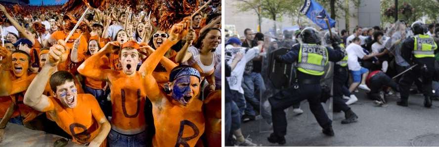

```{r xaringan-themer, include=FALSE, warning=FALSE}
#This block contains the theme configuration for the CSS lab slides style
library(xaringanthemer)
library(showtext)
style_mono_accent(
  base_color = "#5c5c5c",
  text_font_size = "1.5rem",
  header_font_google = google_font("Arial"),
  text_font_google   = google_font("Arial", "300", "300i"),
  code_font_google   = google_font("Fira Mono")
)
```

```{r setup, include=FALSE}
options(htmltools.dir.version = FALSE)
```

layout: true

<div class="my-footer"><span>David Garcia - Computational Modelling of Social Systems</span></div> 

---

# So far

**Block 1: Fundamentals of agent-based modelling**
  
- Basics of agent-based modelling: the micro-macro gap
  - Tutorial: ABM basics in Python with Mesa (session 1)
- Modelling segregation: Schelling's model
  - Tutorial: ABM basics in Python with Mesa (session 2)
- Modelling cultures
  - Exercise 1: Schelling's model and Pandas (session 1)

**Block 2: Opinion dynamics**
- **Today:** Basics of spreading: Granovetter's threshold model
 - Exercise 1: Schelling's model and Pandas (session 2)
- Opinion dynamics
  - Exercise 2: Threshold models (session 1) **Deadline: 20.04.2022**

---

# Overview

## 1. Collective behavior

## 2. Granovetter's threshold model

## 3. Modelling online collective emotions

---

# Collective behavior

## *1. Collective behavior*

## 2. Granovetter's threshold model

## 3. Modelling online collective emotions

---

# More is different

```{r, echo=FALSE, out.width=750, fig.align='center'}

```
[More is different: broken symmetry and the nature of the hierarchical structure of science. Philip Anderson, Science (1972)](https://cse-robotics.engr.tamu.edu/dshell/cs689/papers/anderson72more_is_different.pdf)

---

## Complexity Science: Complicated versus complex

.pull-left[
```{r, echo=FALSE, out.width=750, fig.align='center'}

```
]

.pull-right[
```{r, echo=FALSE, out.width=750, fig.align='center'}

```
]

- A **complicated system** has many pieces with specific functions and well-defined relationships. It has been carefully **engineered or designed**.  
- A **complex system** is composed of many particles that interact following some forces or dynamics. Its behavior follows from **natural principles**.

---

# Complexity in pop culture
.pull-left[
```{r, echo=FALSE, out.width=290, fig.align='center'}

```
]
.pull-right[
```{r, echo=FALSE, out.width=310, fig.align='center'}
knitr::include_graphics("Figures/Matrix.jpg")
```
]
---

# Collective behavior in complex systems

```{r, echo=FALSE, out.width=600, fig.align='center'}

```
[Challenges and solutions for studying collective animal behaviour in the wild. Lacey Hughey et al. Philosophical Transactions of the Royal Society B (2018)](https://royalsocietypublishing.org/doi/10.1098/rstb.2017.0005)
---

# Collective behavior in social systems

**Interaction-induced collective behavior:** when the strength of interaction between individuals generates macro behavior
  - Schelling's model: low tolerance triggers moves that lead to segregation
  - Alxelrod's model: cultural exchange leads to larger cultures or supports coexistence of few cultures

**Diversity-induced collective behavior:** when the differences between individuals create the environment for macro behavior to emerge
  - Today's case: interaction strength and average agent stays the same, only variance between agents is the driver
  - More on network models: different positions in a social network are a way to induce cascades

---

# Granovetter's threshold model

## 1. Collective behavior

## *2. Granovetter's threshold model*

## 3. Modelling online collective emotions

---

# Binary decisions and collective behavior

.pull-left[The riot toy example:
- A group of individuals is part of a demonstration
- Individuals have a threshold of how many others have to be rioting to join the riot
- If enough people are in the riot, individuals with lower threshold join too]
.pull-right[
```{r, echo=FALSE, out.width=500, fig.align='center'}

```
]


- Proto-opinion: just participate / not participate
- Other examples with binary decisions depending on size: Diffusion of innovations, rumors, strikes, voting, leaving a party, migration

---

# Diversity in collective behavior

```{r, echo=FALSE, out.width=1000, fig.align='center'}

```

- How does the distribution of preferences (thresholds) in a population affect its collective behavior? 
- Knowing the preferences does not directly tell you how the population will behave, you need to analyze how the population behaves
- Aim: understanding groups beyond the representative "mean" member

---

# Rational agents in collective action

Assumption: the decision to join the collective action depends on:

- Risk or cost of participating.
- Examples of risks and costs:
  - Risk of being jailed in riot
  - Wage loss in strike
  - Cost of technology adoption


- The benefit (potential or sure) of the action taking place.
- Examples of benefits:
  - Political change after demonstration
  - Profit out of adopting innovation
  - Political party winning an election

---

# An example of spreading

<iframe width="1040" height="500" src="https://www.youtube.com/embed/GA8z7f7a2Pk" title="YouTube video player" frameborder="0" allow="accelerometer; autoplay; clipboard-write; encrypted-media; gyroscope; picture-in-picture" allowfullscreen></iframe>

---

# Net benefit and thresholds

.pull-left[
Net benefit =  benefit - costs

- Threshold to join: Net benefit is >0

- benefits increase and costs decrease with more people in the action (monotonic net benefit)

- weaker assumption: there is only one crossing of zero in the function of net benefit vs people in action

]

.pull-right[
```{r, echo=FALSE, out.width=800, fig.align='center'}
knitr::include_graphics("Figures/Benefit.png")
```
Example of net benefit function from Granovetter (1978)
]

---

# Toy example of Granovetter's model

```{r, echo=FALSE, out.width=950, fig.align='center'}

```

- 100 Agents
- Uniform sequence of thresholds with integer values $[0,99]$
- First agent activates, then second, and so on
- One agent joins per iteration and all agents are active in the end

---

## Toy example of Granovetter's model version 2

```{r, echo=FALSE, out.width=925, fig.align='center'}

```

- Same example as before but agents with thresholds $1$ and $3$ now have threshold $2$
- First agent activates and simulation ends
- Radically different outcome for minimal change in thresholds!
- Deducing preference distributions from collective outcomes is risky

---

# Analyzing the distribution of thresholds
.pull-left[
- $F(x)$ is the cummulative density function of thresholds:

$$F(x) = P(\Theta_i < x) $$
- $r(t)$ is the number of active agents at time $t$
- $r(0)$: number of "instigators"
- Simulation reaches an equilibrium:
$$ r_e = F(r_e)$$
]

.pull-right[
```{r, echo=FALSE, out.width=600, fig.align='center'}
knitr::include_graphics("Figures/CDF.png")
```
]

---

# $r_e$ versus $\sigma$

.pull-left[
```{r, echo=FALSE, out.width=500, fig.align='center'}
knitr::include_graphics("Figures/STD.png")
```
]
.pull-right[

- Assumption: Thresholds follow normal distribution with $\mu$ and $\sigma$
- $r_e$: equilibrium number of active agents (simulation ended)
- $\sigma$: standard deviation of distribution of thresholds
- Number of agents is constant: 100
- $\mu$ is constant: 25


- Sharp increase in $r_e$ at a critical $\sigma$ value: phase transition
- Diversity-induced collective behavior
]


---

# Equlibrium in thresholds with $\sigma=1$

```{r, echo=FALSE, out.width=600, fig.align='center'}
knitr::include_graphics("Figures/s1.svg")
```

Low variance: thresholds concentrated around 25, no collective action
---

# Equlibrium in thresholds with $\sigma=10$

```{r, echo=FALSE, out.width=600, fig.align='center'}
knitr::include_graphics("Figures/s10.svg")
```

Higher variance but equilibrium is still at low value

---

# Equlibrium in thresholds with $\sigma=12$

```{r, echo=FALSE, out.width=600, fig.align='center'}
knitr::include_graphics("Figures/s12.svg")
```

Equilibrium starts to grow to small values
---


# Equlibrium in thresholds with $\sigma=13$

```{r, echo=FALSE, out.width=600, fig.align='center'}
knitr::include_graphics("Figures/s13.svg")
```

Sharp change to upper equilibrium with very high value
---


# Equlibrium in thresholds with $\sigma=60$

```{r, echo=FALSE, out.width=600, fig.align='center'}
knitr::include_graphics("Figures/s60.svg")
```

Slow decrease of equilibrium point towards very high variances
---

## Granovetter's model: take home messages

- **Modelling action as rational choice:** thresholds as points where benefits outweigh costs or risks

- **Diversity matters:** Two populations with the same average threshold have very different behaviors even if mean threholds are the same

- **Tipping point or phase transition:** behavior changes dramatically at a narrow range of standard deviation of thresholds

- **Size effects:** small changes in threshold sequences can be important. When the population is small, you have a probability of very different outcomes. Inferring the preferences from the outcome is very hard and/or misleading

---

# Modelling online collective emotions

## 1. Collective behavior

## 2. Granovetter's threshold model

## *3. Modelling online collective emotions*

---

# Collective emotions

```{r, echo=FALSE, out.width=900, fig.align='center'}

```

**Collective emotions:** Emotional states shared by a large amount of people at the same time  

[Collective Emotions, Christian von Scheve and Mikko Salmela, Oxford University Press (2013)](https://global.oup.com/academic/product/collective-emotions-9780199659180?cc=at&lang=en&)
---

# Collective emotions on social media

```{r, echo=FALSE, out.width=825, fig.align='center'}

```

[Kony 2012 Timeline [Infographic], Chris Holden, The Huffington Post](https://www.huffpost.com/entry/kony-2012-timeline_b_1387729)

---

## Quantifying emotions: valence and arousal

.pull-left[]
.pull-right[

- **Valence:** the degree of pleasure experienced in an emotion 
  - Explains the most variance from positive/pleasant to negative/unpleasant

- **Arousal:** the level of activity associated with an emotion  
  - Explains less variance than valence but it is informative to differentiate emotions  

]

---

## The Cyberemotions modelling framework

```{r, echo=FALSE, out.width=500, fig.align='center'}

```

- Horizontal: agent design
  - $v$, $a$: internal valence and arousal emotional state of the agent
  - $s$: visible emotional expression as measured (e.g. pos/neg/neu)
- Vertical: interaction between agents
  - $h$ is a communication field averaging recent expression of agents
  - Agent's emotions change with time and the value of $h$
---

# Valence and arousal dynamics

```{r, echo=FALSE, out.width=900, fig.align='center'}

```

- $b,d$: baselines of valence and arousal
- $\gamma_v$, $\gamma_a$: relaxation tendency of valence and arousal towards baselines
- $\xi_v$, $\xi_a$: stochastic components of valence and arousal dynamics

[The dynamics of emotions in online interaction. David Garcia, Arvid Kappas, Dennis Küster and Frank Schweitzer. Royal Society Open Science (2016)](https://royalsocietypublishing.org/doi/10.1098/rsos.160059)

---
# Examples of field influence functions

```{r, echo=FALSE, out.width=1000, fig.align='center'}

```

- Field influence functions as products of a polynomial of valence and arousal

- Approximation to some unknown function to fit empirically

- Valence depends on $h$ (pos/neg) and arousal on $|h|$ (absolute value)

---

# Activation function

$$\large s_i(t) = f_s(v_i(t)) \Theta [a_i(t) - \tau_i]$$
- $s_i(t)$ is the visible emotional expression of agent $i$ aggregated in field $h$

- $f_s(v)$ is a function of how valence is expressed through text
  - For example only sign or an approximation of internal valence

- $\tau_i$ is agent $i$'s arousal threshold to expression

- $\Theta[x]$ is the Heaviside step function: it has value 1 if $x>0$, and 0 otherwise

- After expression: reset of arousal to baseline ( $a_i(t) \leftarrow d$ )
---

# Behavior in simulations

```{r, echo=FALSE, out.width=750, fig.align='center'}

```

[An agent-based model of collective emotions in online communities. Frank Schweitzer, David Garcia. The European Physical Journal B, 2010](http://www.springerlink.com/index/10.1140/epjb/e2010-00292-1)

---

# Calibration experiment setup

```{r, echo=FALSE, out.width=750, fig.align='center'}
knitr::include_graphics("Figures/Post.png")
```

- Study 1: reading pos/neg/neu threads and self-reports at home
- Study 2: reading pos/neg/neu threads and self-reports in the lab
- Study 3: reply to pos/neg/neu threads and self-reports before/after
- Self-reports include valence and arousal ratings and intention to participate in discussion and to continue reading the thread

---

# Valence result


```{r, echo=FALSE, out.width=900, fig.align='center'}
knitr::include_graphics("Figures/ValenceExp.png")
```

- Dynamics well fitted by a linear function with intercept shift depending on thread polarity ( $h$ ). Natural decay of valence with $\gamma_v = 0.37 \quad  [min^{-1}]$
---

# Arousal trigger results

```{r, echo=FALSE, out.width=900, fig.align='center'}

```

- Dynamics well fitted by a linear function with intercept shift depending on thread abs value ( $|h|$ ). Natural decay of arousal with $\gamma_a = 0.41 \quad  [min^{-1}]$
---

# Empirical expression function

```{r, echo=FALSE, out.width=850, fig.align='center'}
knitr::include_graphics("Figures/SentiExp.png")
```

- Probability of post being classified as positive vs not positive and negative vs not negative in logistic regression (SentiStrength output with threshold)
- Function of valence but independent of arousal
---

# Expression trigger and effects

```{r, echo=FALSE, out.width=900, fig.align='center'}

```

- Probability to participate is flat up to a threshold of arousal, then it grows
- Effect of expression of arousal is a linear approach to baseline, not a resert

---

# Summary

- Collective behavior in social systems
  - Complex versus complicated systems
  - Interaction versus diversity-induced collective behavior


- Granovetter's threshold model
  - Interaction in a well-mixed system given preferences or thresholds
  - Macro outcomes can vary a lot for small changes in threshold values
  - Variance in thresholds leads to aggregated activation


- Modelling online collective emotions
  - The Cyberemotions modelling framework 
  - Activation dynamics based on arousal thresholds
  - Calibrating an emotions model with experiments


---

# Quiz

- Which of these is complex and which is complicated?
  - An airplane
  - The Internet
  - The Web
  - A deep neural network
- For a given $\sigma$, does $\mu$ change the outcome in Granovetter's model?
- How can you find the fraction of active agents at $t=0$ in Granovetter's model?
- In experiments, what does sentiment on text depend on: valence or arousal?

**Please give us feedback!** Answers are anonymous and private
.center[
<div style="font-size:40pt">
<a href=https://fbr.io/CMSS1>https://fbr.io/CMSS1</a>
</div>
]