```{r xaringan-themer, include=FALSE, warning=FALSE}
#This block contains the theme configuration for the CSS lab slides style
library(xaringanthemer)
library(showtext)
style_mono_accent(
  base_color = "#5c5c5c",
  text_font_size = "1.5rem",
  header_font_google = google_font("Arial"),
  text_font_google   = google_font("Arial", "300", "300i"),
  code_font_google   = google_font("Fira Mono")
)
```

```{r setup, include=FALSE}
options(htmltools.dir.version = FALSE)
```

layout: true

<div class="my-footer"><span>David Garcia - Computational Modelling of Social Systems</span></div> 

---

## So far

- **Block 1: Fundamentals of agent-based modelling**
  - Basics of agent-based modelling: the micro-macro gap
  - Modelling segregation: Schelling's model
  - Modelling cultures


- **Block 2: Opinion dynamics**
  - Basics of spreading: Granovetter's threshold model
  - Opinion dynamics
  - Modelling hyperpolarization and cognitive balance


- **Block 3: Fundamentals of agent-based modelling**
  - **Today: Basic network models**
  - Modelling small worlds
  - Scale-free networks
  - Growth processes

---

# Overview

## 1. Random graphs

## 2. Poisson random graphs

## 3. Giant component

## 4. Null models

---

# Random graphs

## *1. Random graphs*

## 2. Poisson random graphs

## 3. Giant component

## 4. Null models

---

# Refresher: Social networks
<div style="float:right">
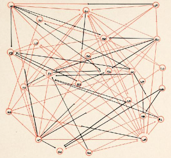  
</br>
Jacob Moreno's sociogram
</div>

Social Networks are models to represent individuals and the relationships between them. The minimal components of a social network are:  

- **Nodes** (or vertices), which represent individuals. These individuals are social actors, for example, humans, animals, fictional characters...
- **Links** (or edges) are relationships between individuals, for example, friendship, family ties, interaction, communication...

---

# Refresher: Representing social networks
<div style="float:right">
  
</div>
A graph or network is a tuple $G = (n, m)$  
  - n is a set of vertices or nodes  
  - m ⊆ n × n is a set of edges or links  
  - n × n is the Cartesian product (i.e. the set of all possible links)  

Edges are denoted as ordered pairs $(i, j)$, which means that a link points from node $i$ to node $j$. 

The example of the picture can be written as:  
$n = {a, b, c, d, e}$  
$m = {(b, a),(c, a),(e, a),(d, e),(c, b),(b, c)}$

---

# Random graphs

- **Networks** that possess a particular property
  - Which are otherwise random (e.g., fixed degree distribution)


- **Analysis** performed by comparing (two) different model network structures
  - E.g., non-scale-free networks vs. scale-free networks

```{r, echo=FALSE, out.width=650, fig.align='center'}
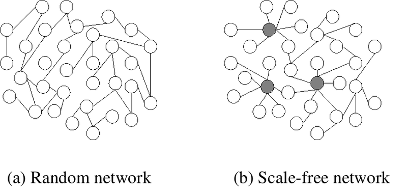
```

---

# Random graphs

- **Measurements** of network data for (two) different structures
  - Mathematically
  - Computationally
  - **Statistically**


- **Behavior** of such mathematical models of (two) different network structures
  - E.g., dynamic processes on networks - interaction between nodes in a social (connected) network
  - Consensus, opinion formation models ...

---

# Random graph ensamble

.pull-left[
```{r, echo=FALSE, out.width=900, fig.align='center'}
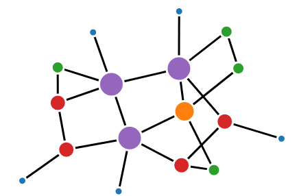
```
]

.pull-right[
- Consider a **simple graph** with the following fixed parameters:
  - Number of vertices (n)
  - Number of edges (m)


- For such **Random graph G(n,m)** created in the following method:
  - Place edge (m) between (uniformly) random chosen pair
  - Prevent multiedge/self-edge by: distinct pairing, only to already not connected vertices
]

---

# Random graph ensamble

.pull-left[
- There is not one but an ensamble of networks that satisfy the fixed constraints
  - E.g., for n=20 and m=22


- Probability of such networks $P(G)$
  - $P(G)=\frac{1}{\omega}$ , for such networks where $\omega$ is the number of such networks
  - $P(G)=0$ , for all other networks
]

.pull-right[
```{r, echo=FALSE, out.width=900, fig.align='center'}
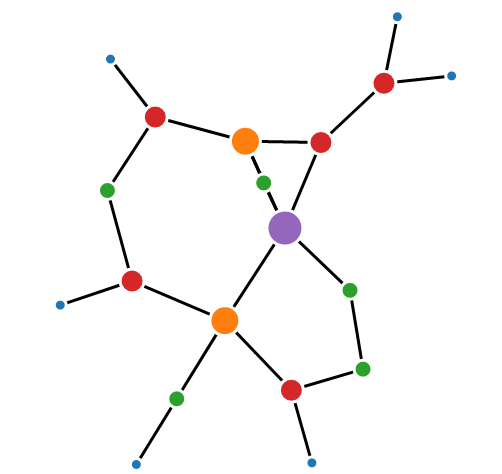
```
]

---

# Random graph ensamble

- Segregated components are also possible

```{r, echo=FALSE, out.width=450, fig.align='center'}
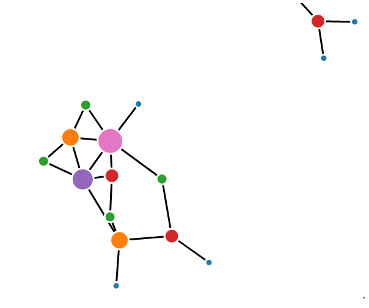
```

---

# Simple graph

```{r, echo=FALSE, out.width=900, fig.align='center'}
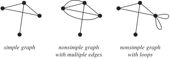
```

---

# Random graph ensamble

- Ensambles have *typical* behavior based on **properties (averages)**
  - Number of edges is the number of connections between all vertices
$$\langle m \rangle$$
  - Diameter of a graph is the largest finite distance between any two vertices
$$\langle l \rangle = \sum_{G} P(G)l(G) = \frac{1}{\omega} \sum_{G} l(G)$$
  - Degree of a vertex is the number of adjacent edges, **also known as $c$**
$$\langle k \rangle = c = 2 \frac{m}{n}$$

---

# Two interesting random graphs ensembles

.pull-left[
1. G(n,m) - fixed number of edges $m$
2. G(n,p) - fixed **probability** of edges $p(m)$
  - The edges $m$ are not-fixed
  - The vertices $n$ are fixed


- E.g., Erdos - Renyi model
]

.pull-right[
```{r, echo=FALSE, out.width=450, fig.align='center'}
knitr::include_graphics("Figures/erdos_renyi.png")
```
]

---

# G(n,p) ensamble

- Probability of such G(n,p) networks $P(G)$:
  - $P(G) = p^m(1-p)^{(\frac{n}{2})-m}$ , for such networks
  - $P(G)=0$ , for non-simple graphs

.pull-left[
- p = 0.1
```{r, echo=FALSE, out.width=300, fig.align='center'}
knitr::include_graphics("Figures/g_n_p_0_1.png")
```
]
.pull-right[
- p = 0.05
```{r, echo=FALSE, out.width=300, fig.align='center'}
knitr::include_graphics("Figures/g_n_p_0_0_5.png")
```
]

---

## Analytical behavior analysis of G(n,p) ensemble

- Mean number of edges $\langle m \rangle$
  - **Distinct vertex pairs** $\binom{n}{2}$ * probability of an edge $p$;


$$\langle m \rangle = \binom{n}{2} p$$
- Mean degree of vertex $c$
  - Number of other vertices $(n-1)$ * probability of an edge $p$


$$c = (n-1)p$$

---

- Degree distribution $p_{k}$ (for a vertex connected with $k$ others)
  - **Distinct vertex pairs** $\binom{n-1}{k}$ * probability of connection with $k$ vertices, but not with others


$$p_{k} = \binom{n-1}{k}p^{k}(1-p)^{n-1-k}$$
.pull-left[
```{r, echo=FALSE, out.width=400, fig.align='center'}
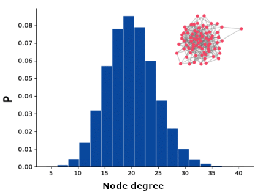
```
]
.pull-right[
Degree distribution with $n=10^5,c =20$ is a **binomial distribution**
]

---

# Recap basics: Binomial distribution

- Binomial distribution with parameters $n$ and $p$
  - The discrete probability distribution of the number of successes in a sequence of n independent experiments
  - Each experiment asks a yes-no question (boolean-valued outcome)
  - Success (with probability p)
  - Failure (with probability q = 1 − p)


```{r, echo=FALSE, out.width=500, fig.align='center'}
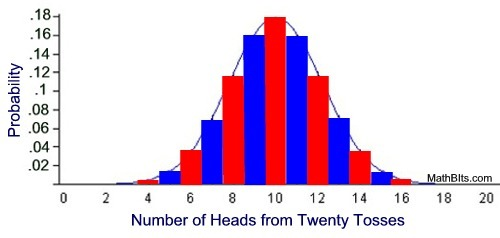
```

---

# Example G(n,p) ensemble

.pull-left[
- $n = 20, p = 0.1$
- $\langle m \rangle = 190 * 0.1 = 19$
- $c = (20-1) * 0.1 = 1.9$
- $p_{3} = 969 * 0.001 * 0.185 = 0.18$
```{r, echo=FALSE, out.width=300, fig.align='center'}
knitr::include_graphics("Figures/g_n_p_0_1.png")
```
]
.pull-right[
- $n=20, p = 0.05$
- $\langle m \rangle = 190 * 0.05 = 9.5$
- $c = (20-1) * 0.05 = 0.95$
- $p_{3} = 969 * .000125 * .44 = .05$

```{r, echo=FALSE, out.width=300, fig.align='center'}
knitr::include_graphics("Figures/g_n_p_0_0_5.png")
```
]

---

# Poisson random graphs

## 1. Random graphs

## *2. Poisson random graphs*

## 3. Giant component

## 4. Null models

---

## Function asymptotically approaches some value

```{r, echo=FALSE, out.width=500, fig.align='center'}
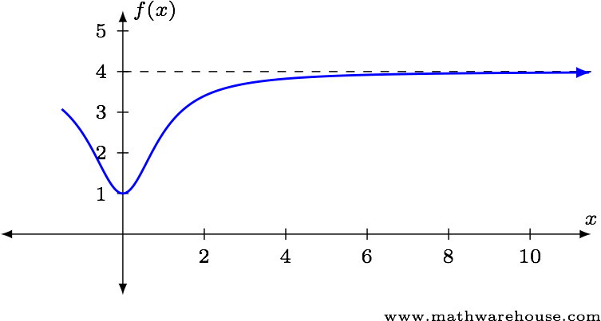
```


- Asymptotically equal-to/approaches some value
  - The function approaches a particular finite value
  - Horizontal asymptotes are defined as limits at infinity

---

# Large networks $n\rightarrow\infty$

- What happens to the degree distribution as $n$ goes to infinity $n\rightarrow\infty$

$$p_{k} = \binom{n-1}{k}p^{k}(1-p)^{n-1-k}$$

- The binomial distribution approaches the **Poisson distribution**

---

# Poisson random graph

- Special case of G(n,p) ensemble for large networks $n\rightarrow\infty$


- Mean degree $c$ - constant over large networks
  - Number of friends does not depend on the number of people in the world


$$c = (n-1)p \Rightarrow p = \frac{c}{n-1} , n\rightarrow\infty$$
  - Vanishingly small probability $p$ of an edge

   
- Degree distribution (for a vertex) $p_k$


$$p_{k} = e^{-c} \frac{c^{k}}{k!}, n\rightarrow\infty$$

---

## Analytical behavior analysis of G(n,p) ensemble

- Clustering coefficient $C$
  - Transitive behavior (property) in a network
   - What is the probability that two vertex neighbors are also neighbors of each other?


$$C = \frac{c}{n-1}$$

```{r, echo=FALSE, out.width=600, fig.align='center'}
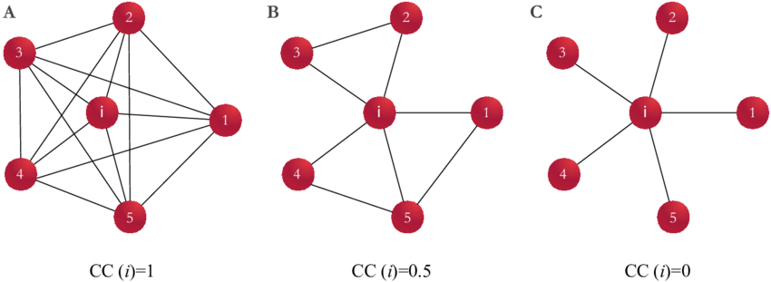
```

---

- Poisson random graphs for large networks
  - Clustering coefficient $C \simeq 0 , n\rightarrow\infty$, if mean degree $c$ is fixed


- Difference between the RNG and real-world networks: real-world networks have a high clustering coefficient $C$

.center[]

---

# Giant component

## 1. Random graphs

## 2. Poisson random graphs

## 3. *Giant component*

## 4. Null models

---

## Largest component for large networks $n\rightarrow\infty$

- If $p = 0$; independent of size $n$
  - Disconnected network
  - $n$ separate components - vertices isolated


- If $p = 1$; dependent of size $n$
  - 1-single component
  - Each vertex is connected to each other
  - **Giant component** - connected component of a network that contains most of the entire nodes in the network


- Most networks (should) have a large component that fills the network
  - To be able to perform the intended role

---

# Internet connected component

```{r, echo=FALSE, out.width=500, fig.align='center'}
knitr::include_graphics("Figures/internet_map.png")
```

---

### Sensitivity of parameter $p[0,1]$ vs. largest component
- How the size to the largest component changes in respect to $p$?
  - Expected: The size increases gradually and it is **extensive** around $p = 1$
  - Reality: Largest component suddenly changes for one particular value of $p$
  - **Phase transition**


.pull-left[
```{r, echo=FALSE, out.width=400, fig.align='center'}
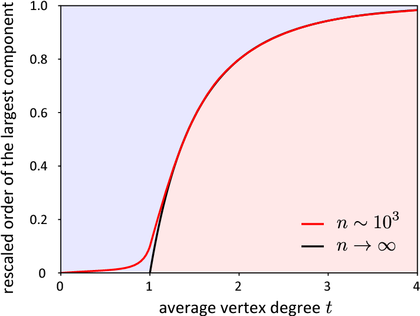
```
]
.pull-right[
Kang, M., & Petrášek, Z. (2014). Random graphs: Theory and applications from nature to society to the brain
]

---

#Size of the giant component

.pull-left[
```{r, echo=FALSE, out.width=600, fig.align='center'}
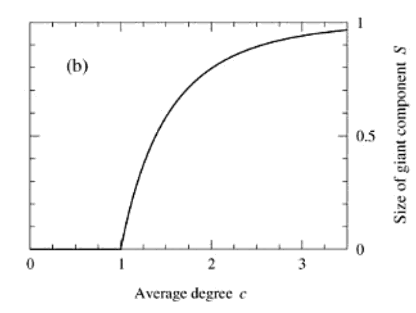
```
]

.pull-right[
- Size of the giant component for $c>1$ is larger than one of the possible solutions $S=0$
  - This is illustrated on the figure for all values of $c$, with a limit at $c=1$ for two given cases
  - Phase transition

```{r, echo=FALSE, out.width=300, fig.align='center'}
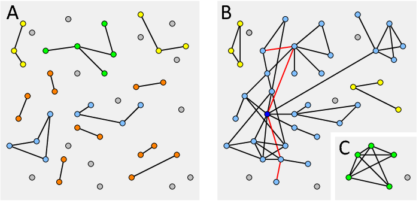
```
]

---

# Phase transition examples

.pull-left[
- Schelling
```{r, echo=FALSE, out.width=750, fig.align='center'}
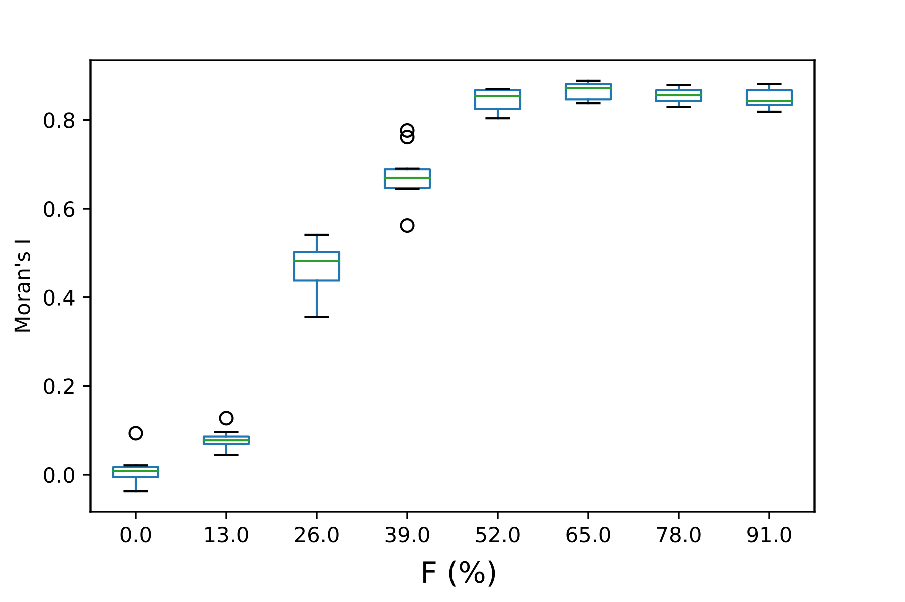
```
]

.pull-right[
- Granovetter
```{r, echo=FALSE, out.width=750, fig.align='center'}
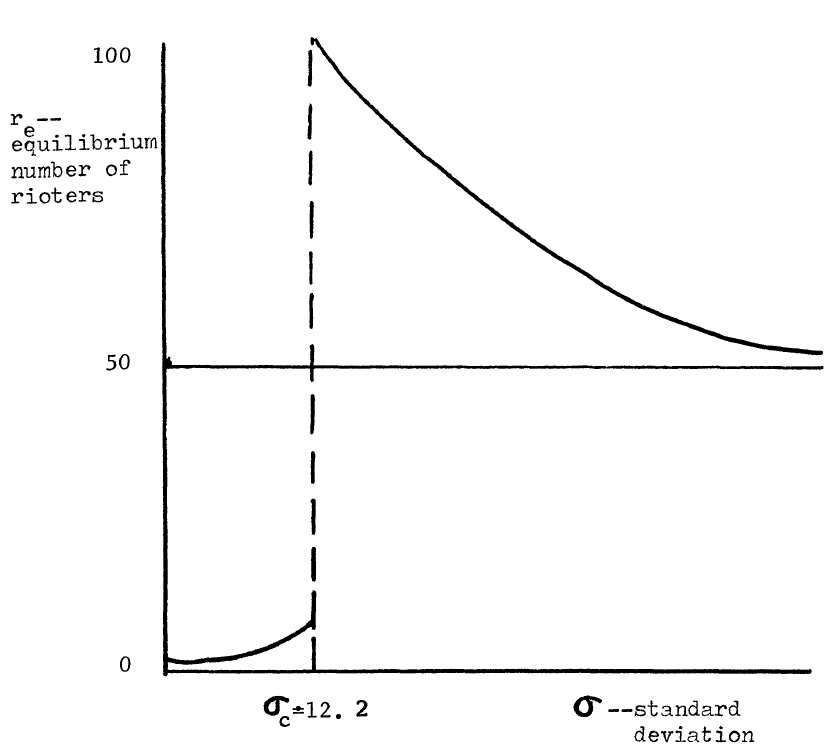
```
]

---

#### Analytical behavor analysis of G(n,p) ensamble for large networks $n\rightarrow\infty$

.pull-left[
```{r, echo=FALSE, out.width=450, fig.align='center'}
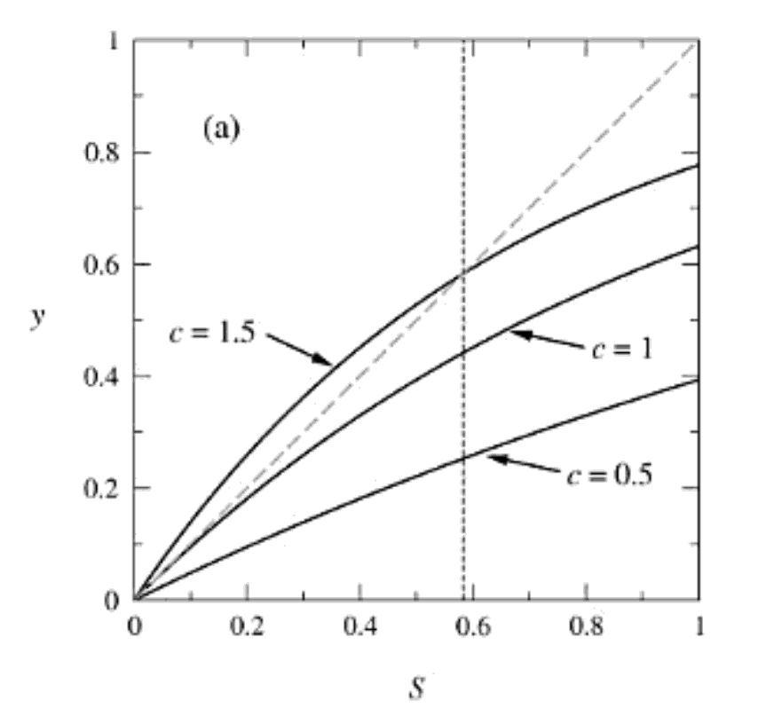
```
]

.pull-right[
- $S$ - size proportion of a large component
- $c$ - average degree of a vertex
1. Size $S=0$
  - Small $c$ - no giant component
2. Size $S=0$ and $S>0$ 
  - Large $c$ - there is giant component
  - Transition phase happendes in between small/large $c$, where gradient of the diagonal matches the gradient of the curve for $S=0$
]

---

# Null models

## 1. Random graphs

## 2. Poisson random graphs

## 3. Giant component

## 4. *Null models*

---

# Random graphs as null models

- Most real-world networks show an average distance that is comparable to that of the corresponding random graph
  - But their average clustering coefficient is much higher


- Exploratory data analysis
  - Given the **observed** value of a structural measure in a real-world network it can be compared with the **expected** value of that measure in a graph in which the network’s structure is randomized
  - Any structure is tested to whether it deviates from the structure of some pre-defined model

---

# Social network example

.pull-left[
```{r, echo=FALSE, out.width=600, fig.align='center'}
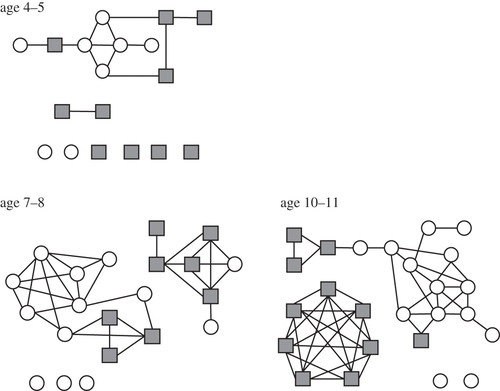
```
]
- Increasing complexity, cliquishness, and gender segregation with age
  - Filled squares, girls; open circles, boys.


- It is well known that, in general, same-gender friendships are more likely than boy-girl friendships
  - Especially in primary school. 

---

# Social network example

- Conlan et al. compared the number of these edges with the expected one in a model where each child maintains the number of declared and received friendship declarations concerning the gender of the other child
  - The mutuality is still statistically significant in almost all cases
  - The effect is less pronounced than if compared with a simple directed random graph in which the gender is not regarded. 


- *Note that this can be modeled structurally by defining two different in-degrees and two different out-degrees, each differentiated by the gender of the other child*
  - The random graph model then maintains both types of in- and outdegrees


Conlan et al. (2011) Measuring social networks in British primary schools through scientific engagement

---

# Random graphs as null models

- In terms of statistics, the null-hypothesis assumes that graph $\mathcal{G}$ was produced by the random graph model
  - This null hypothesis is rejected if it is very unlikely that the model is true
  - The random graph model is also often called **the null model** 


- The **p-value** $P(G|\mathcal{G})$ itself, i.e., the probability that the observed graph $G$ was produced by some random graph model $\mathcal{G}$, does not directly give you the probability $P(\mathcal{G}|G)$, i.e., the probability that the model is true when $G$ is observed
  - Read more: Permutation test lecture in Foundations of CSS

---

## Comparison between an observed and null model

```{r, echo=FALSE, out.width=400, fig.align='center', fig.cap='Clustering coefficient vs. age of school class within the network of mutual links'}
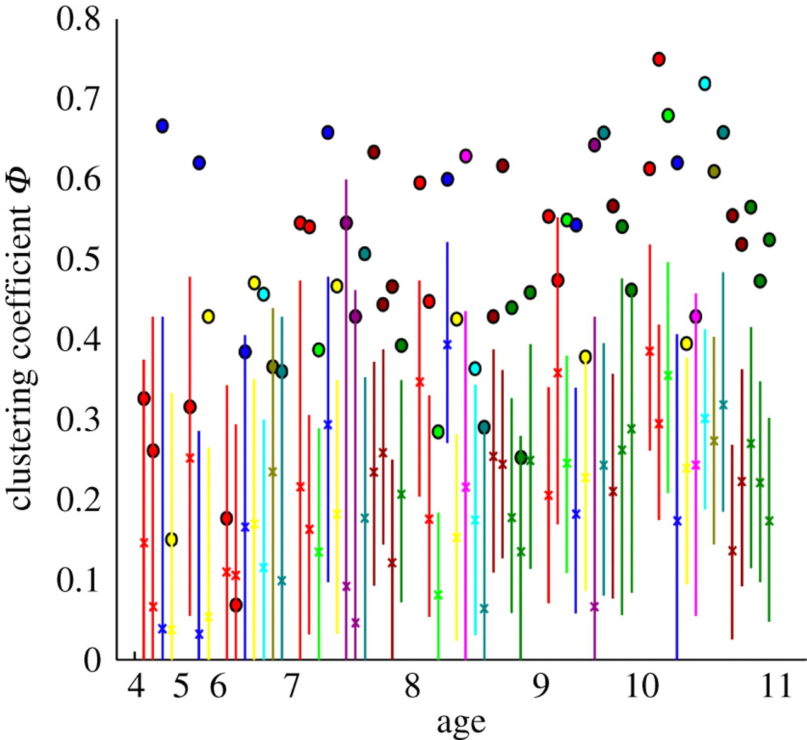
```

---

## Summary

- Random graphs
  - Simple graphs with fixed parameters (vertices, edges)
  - There is an ensemble of networks that satisfy the fixed constraints


- Large networks where $n\rightarrow\infty$
 - Degree distribution of a vertex approaches the Poisson distribution
 - Clustering coefficient $C \simeq 0$ if mean degree $c$ is fixed


- Giant component contains most of the entire nodes in the network
  - Largest component suddenly changes for one particular value of $p$
  - Phase transition happens at $c=1$


- The null hypothesis assumes that graph $\mathcal{G}$ was produced by the RNG
  - Real-world networks' average clustering coefficient is high
  - This null hypothesis is rejected if the assumption is unlikely
  
---
# Quiz

- If we flip a coin 20 times, what probability is for 10 heads?

- Do all graphs in the ensemble G(n,m) have the same number of edges?

- What is the density of a network?

- What is the largest possible diameter $l$ of a network with 20 nodes?