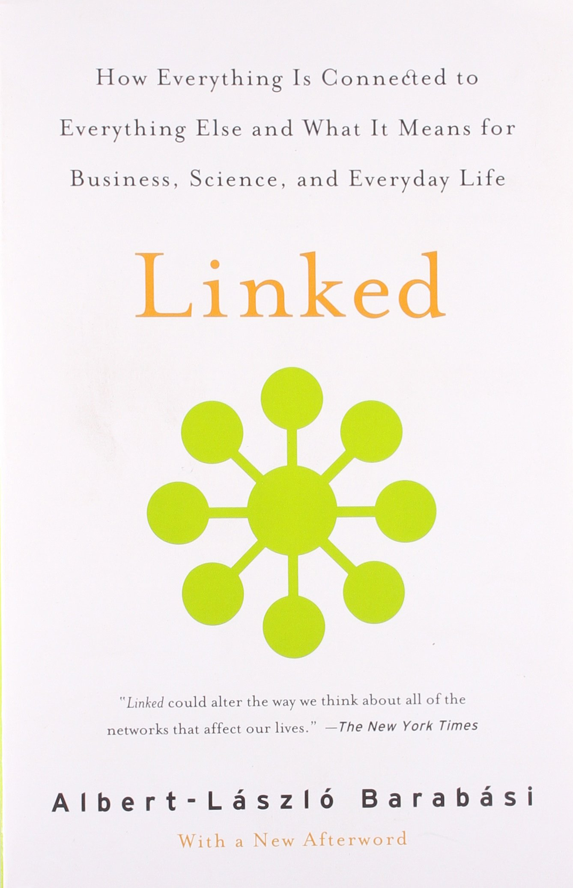
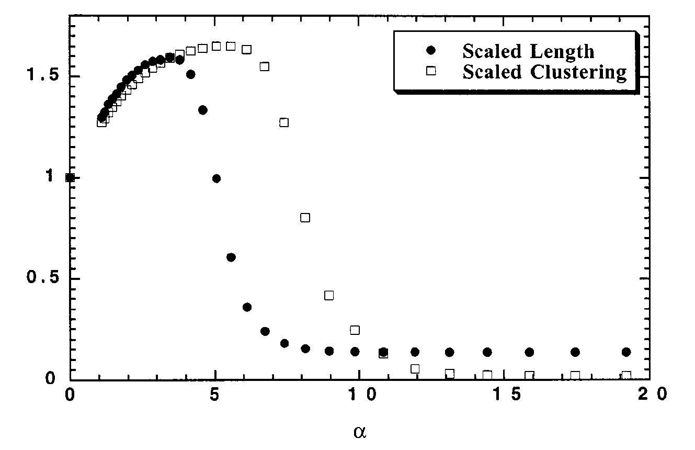

```{r xaringan-themer, include=FALSE, warning=FALSE}
#This block contains the theme configuration for the CSS lab slides style
library(xaringanthemer)
library(showtext)
style_mono_accent(
  base_color = "#5c5c5c",
  text_font_size = "1.5rem",
  header_font_google = google_font("Arial"),
  text_font_google   = google_font("Arial", "300", "300i"),
  code_font_google   = google_font("Fira Mono")
)
```

```{r setup, include=FALSE}
options(htmltools.dir.version = FALSE)
```

layout: true

<div class="my-footer"><span>David Garcia - Computational Modelling of Social Systems</span></div> 

---

## So far

- **Block 1: Fundamentals of agent-based modelling**
  - Basics of agent-based modelling: the micro-macro gap
  - Modelling segregation: Schelling's model
  - Modelling cultures


- **Block 2: Opinion dynamics**
  - Basics of spreading: Granovetter's threshold model
  - Opinion dynamics
  - Modelling hyperpolarization and cognitive balance


- **Block 3: Fundamentals of agent-based modelling**
  - Basic network models
  - **Today: Modelling small worlds**
  - Scale-free networks
  - Growth processes

---

# Overview

## 1. The small world phenomenon

## 2. The Watts-Strogatz model

## 3. Social small world model

---

# The small world phenomenon

## *1. The small world phenomenon*

## 2. The Watts-Strogatz model

## 3. Social small world model

---

# It's a small world!

```{r, echo=FALSE, out.width=800, fig.align='center'}

```

---

# Six degrees of separation

.pull-left[
```{r, echo=FALSE, out.width=330, fig.align='center'}

```
]
.pull-right[
```{r, echo=FALSE, out.width=300, fig.align='center'}

```
]
---

# The Bacon number

```{r, echo=FALSE, out.width=900, fig.align='center'}
knitr::include_graphics("Figures/bacon.png")
```

---


## Milgram's small world experiment

.pull-left[

- 160 people in Omaha try to reach one person in Boston by mail to their acquaintances

- 44 letters reached the target with six steps on average

- Short path length as evidence of small-world

- However, some letters did not agree, are those paths infinite?
]


.pull-right[
```{r, echo=FALSE, out.width=500, fig.align='center'}
knitr::include_graphics("Figures/map_us.png")
```
]

---

# Refresher: Network distance

.pull-left[

The **distance** between nodes $v$ and $w$ is denoted as $dist(v,w)$ and measures the minimum length among all the paths connecting $v$ and $w$. 

If there is no path between $v$ and $w$, the distance between them is defined as $dist(v,w) := \infty$. 

Example: $dist(b, e) = 2$ 

In directed networks, it might happen that $dist(v,w) \neq dist(w,v)$. 
]

.pull-right[
```{r, echo=FALSE, out.width=400, fig.align='center'}
knitr::include_graphics("Figures/networkUndirected.png")
```
]

---

# Average path length


.pull-left[

$$ \langle l \rangle = \frac{1}{N(N-1)}\sum_{u,v} dist(u,v) $$


- Global metric for the whole network

- It makes sense when network is connected, otherwise $\langle l \rangle= \infty$

- In the example, $\langle l \rangle=1.7$


]

.pull-right[
```{r, echo=FALSE, out.width=400, fig.align='center'}
knitr::include_graphics("Figures/networkUndirected.png")
```
]
---

# Refresher: Clustering coefficient

.pull-left[
**Local clustering coefficient**:

$$C_i = \frac{2*t(i)}{d_i *(d_i−1)}$$

- $d_{out}(i)$ is the degree of $i$ (>1) 
- $t(i)$ is the number of pairs of neighbors of $i$ that are connected

**Average clustering coefficient**:

$$C = \frac{1}{N} \sum_i C_i$$


]

.pull-right[
```{r, echo=FALSE, out.width=400, fig.align='center'}

```
]

---

# The Watts-Strogatz model

## 1. The small world phenomenon

## *2. The Watts-Strogatz model*

## 3. Social small world model

*Collective dynamics of ‘small-world’ networks. Duncan J. Watts & Steven H. Strogatz. Nature (1998)*


---

# Clustering versus small distances


- Triangles reduce distances: all nodes in a triangle are at distance one

- Clustering and short path lengths appear to be opposing properties

- Social networks have high clustering (lots of triangles), can they also have short paths? Is the six degrees observation a robust one?

** Research question: can a model produce networks with both high clustering and low average path distance?**

Additional conditions:
- Network is large ( $N \gg 1$ )
- Network is sparse, like a social network ( $\langle k \rangle \ll N$ )

---

# The Watts-Strogatz model

.pull-left[
- Start with a fixed ring where $N$ nodes are connected to $k$ neighbors in the ring

(example: $N=20$, $k=4$)

- For each edge:
  
  - With probability $p$: rewire the edge uniformly at random
  
(two versions: only one endpoint or both are rewired)
]

.pull-right[
```{r, echo=FALSE, out.width=300, fig.align='center'}
knitr::include_graphics("Figures/WS-1.png")
```
]

---

# From order to randomness

```{r, echo=FALSE, out.width=1000, fig.align='center'}
knitr::include_graphics("Figures/WS.png")
```

---

# Properties of the lattice ( $p=0$ )


.pull-left[

**Average clustering coefficient:**

$$C(0) \sim 3/4   $$
(tunable value of $C$ based on $k$)

** Average path length:**

$$L(0) =  \frac{N}{2k} $$
(very high path length, grows linearly with network size)

]

.pull-right[
```{r, echo=FALSE, out.width=300, fig.align='center'}
knitr::include_graphics("Figures/WS-1.png")
```
]

---

# C(p) and L(p) versus C(0) and L(0)

```{r, echo=FALSE, out.width=750, fig.align='center'}

```

---

# Empirical versus random networks

Empirical network analysis of $L$ and $C$ compared to random networks with the same number of nodes and edges (null model, $G(n,m)$ )

| Network | $L_{actual}$ | $L_{random}$ | $C_{actual}$ | $C_{random}$ |
| ----------- | ----------- | ----------- | ----------- | ----------- |
| Film actors | 3.65 | 2.99 | 0.79 | 0.00027 |
| Power grid | 18.7 | 12.4 | 0.080 | 0.005 |
| C. elegans | 2.65 | 2.25 | 0.28 | 0.05 |

**Evidence of small world networks: empirical networks have average path lenghts close to random networks but much higher average clustering**

---

#  Social small world model

## 1. The small world phenomenon

## 2. The Watts-Strogatz model

## *3. Social small world model*

*Networks, Dynamics, and the Small‐World Phenomenon. Duncan J. Watts. American Journal of Sociology (1999)*

---

# Social networks aren't lattices

.pull-left[
```{r, echo=FALSE, out.width=750, fig.align='center'}

```
]

.pull-right[
```{r, echo=FALSE, out.width=750, fig.align='center'}

```
]

---

# The caveman model

```{r, echo=FALSE, out.width=450, fig.align='center'}

```

---

# Modeling propensity to triadic closure

```{r, echo=FALSE, out.width=825, fig.align='center'}

```

---

# Formalizing propensity to triadic closure

```{r, echo=FALSE, out.width=800, fig.align='center'}
knitr::include_graphics("Figures/PropensityEquation.png")
```

- $R_{i,j}$: propensity to connect of agents $i$ and $j$
- $m_{i,j}$: mutual friends between $i$ and $j$
- $p$: base probability to connect when no common friends
- $k$: average degree of network
- $\alpha$: exponent that defines curvature of $R_{i,j}$ versus $m_{i,j}$ 
  - $0 \le \alpha \le \infty$
---

# $\alpha$ in propensity

```{r, echo=FALSE, out.width=825, fig.align='center'}

```

---

# Avg path length vs $\alpha$

```{r, echo=FALSE, out.width=850, fig.align='center'}
knitr::include_graphics("Figures/CavemanPathLength.png")
```

---


# Clustering coefficient vs $\alpha$

```{r, echo=FALSE, out.width=850, fig.align='center'}

```

---

# "Small-worldness" vs $\alpha$

```{r, echo=FALSE, out.width=670, fig.align='center'}

```
**For an intermediate range of values of $\alpha$, average path length is low while the clustering coefficient is high.**

---

## Summary


-  The small world phenomenon
  - Anecdotes and literature suggest that the distance between two random people in the world is not so large
  - Refresher: average path length and average clustering coefficient


- The Watts-Strogatz model
  - From a regular lattice to a random network rewiring with probability $p$
  - For a wide range of middle values of $p$, clustering is high and average path lengths are low
  - Empirical networks show this when compared to random networks


- Social small world model
  - Cavemen rather than lattices as regular network
  - $\alpha$ modulates shape of propensity to connect vs friendships share
  - Shows small-world behavior for an intermediate range of $\alpha$

---
# Quiz

- What fraction of letters in Milgram's experiment reached their destination?

- What is the average path length of a network with an isolated node?

- What is the average clustering coefficient of a tree?

- What is the null model to compare small-world measurements?

- What is a better model of a social network, a lattice or a cavemen network?

- if $\alpha$ is zero, do you connect to the friends of your friends very often?

