```{r xaringan-themer, include=FALSE, warning=FALSE}
#This block contains the theme configuration for the CSS lab slides style
library(xaringanthemer)
library(showtext)
style_mono_accent(
  base_color = "#5c5c5c",
  text_font_size = "1.5rem",
  header_font_google = google_font("Arial"),
  text_font_google   = google_font("Arial", "300", "300i"),
  code_font_google   = google_font("Fira Mono")
)
```

```{r setup, include=FALSE}
options(htmltools.dir.version = FALSE)
```

layout: true

<div class="my-footer"><span>David Garcia - Computational Modelling of Social Systems</span></div> 

---

## So far

- **Block 1: Fundamentals of agent-based modelling**
  - Basics of agent-based modelling: the micro-macro gap
  - Modelling segregation: Schelling's model
  - Modelling cultures


- **Block 2: Opinion dynamics**
  - Basics of spreading: Granovetter's threshold model
  - Opinion dynamics
  - Modelling hyperpolarization and cognitive balance


- **Block 3: Network formation**
  - Basic network models
  - Modelling small worlds
  - **Today: Scale-free networks**

---

# Overview

## 1. Power laws

## 2. The Barabási-Albert model

## 3. The Vertex copying model

## 4. Network data sources

---


# Power laws

## *1. Power laws*

## 2. The Barabási-Albert model

## 3. The Vertex copying model

## 4. Network data sources

---

# With big data comes big heterogeneity
.pull-left[
```{r, echo=FALSE, out.width=500, fig.align='center'}
knitr::include_graphics("Figures/CAIDA.png")
```
Network visualization of the physical Internet (K. C. Claffy, CAIDA).
]

.pull-right[
```{r, echo=FALSE, out.width=450, fig.align='center'}
knitr::include_graphics("Figures/Friendster.png")
```
Network visualization of Friendster
]
---

# Reminder: Node degree

A node's **degree** measures the number of links connected to it. 

In undirected networks there is only one measure of degree $k_i$, which is exactly the number of edges connected to the node $i$. 

In directed networks there are two kinds of degree: 
- **in-degree** $k_{in}(i)$ that is the number of edges ending in $i$, i.e. $(j,i)$
- **out-degree** $k_{out}(i)$ that is the number of edges leaving from $i$, i.e. $(i,j)$. In the first network example above, $k_{in}(c) = 1$ and $k_{out}(c) = 2$.

In weighted networks, **weighted node degrees** are sums of incoming and outgoing link weights. This way there are two weighted node degrees, the weighted in-degree and the weighted out-degree.

---

# Degree distribution

.pull-left[

The degree distribution $P(k)$ of a network measures the relative frequency of degree $k$ among the nodes of the network.

In the example:
- $P(0)=0$
- $P(1)=1/5$
- $P(2)=1/5$
- $P(3)=3/5$
- $P(4)=0$
]

.pull-right[
```{r, echo=FALSE, out.width=450, fig.align='center'}
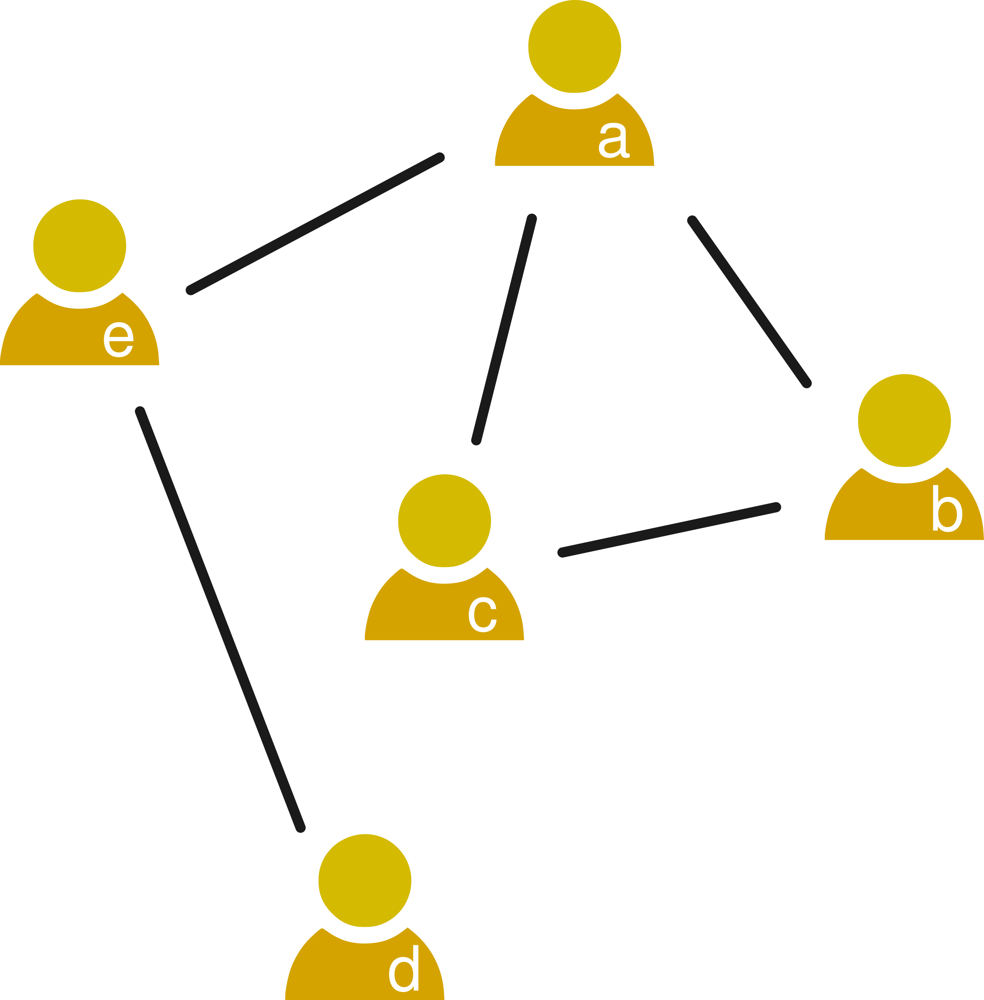
```
]

---

# Histogram showing a degree distribution

```{r, echo=FALSE, out.width=650, fig.align='center'}
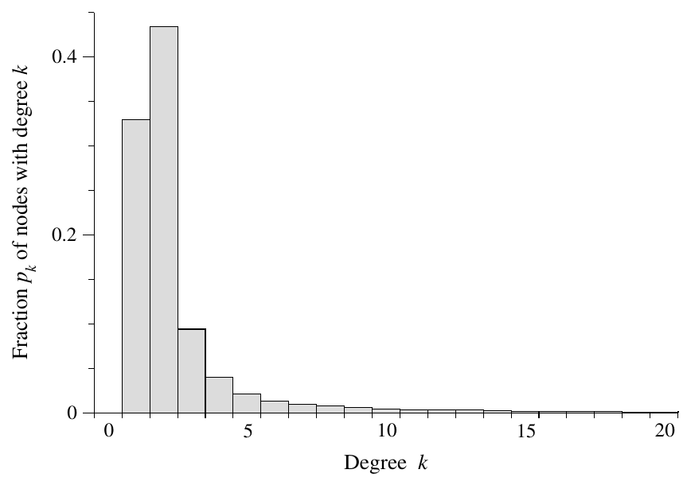
```
Degree distribution of the physical internet (Newman, Ed.2, Chapter 10.3)

---

# Observing inequality: power-laws
```{r, echo=FALSE, out.width=650, fig.align='center'}
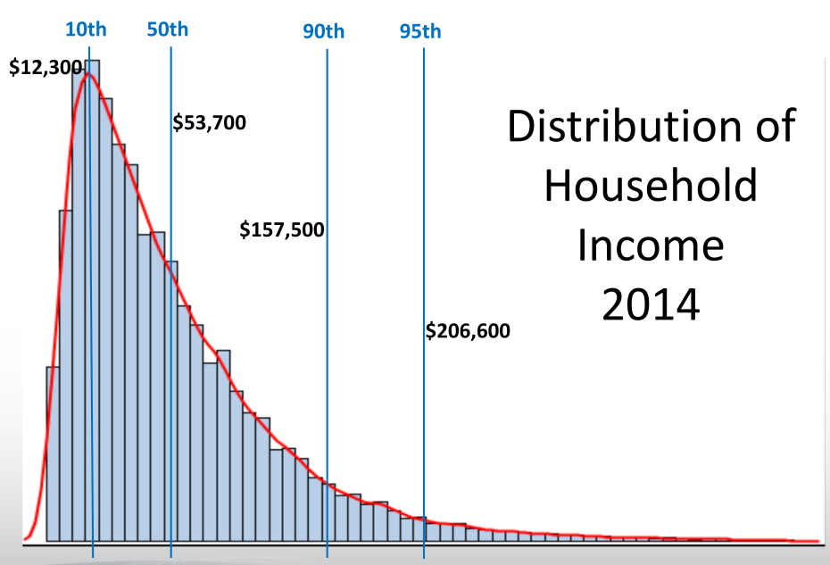
```

The Pareto Principle (80/20 rule): 20% of the people make 80% of the money

---
# Power-law distributions

- **Probability Density Function (PDF)**: $P(x)$ or $P(X=x)$
- Relative likelihood that the value of the random variable $X$ will be equal to $x$
- Power-law PDF: $P(x) = \frac{\alpha-1}{{x_{min}}} \left ( \frac{x}{x_{min}} \right )^{-\alpha}$  or for shorter: $P(x)  \propto  x^{-\alpha}$
- Look like lines of slope $-\alpha$ in log-log plots  

```{r, echo=FALSE, out.width=490, fig.align='center'}
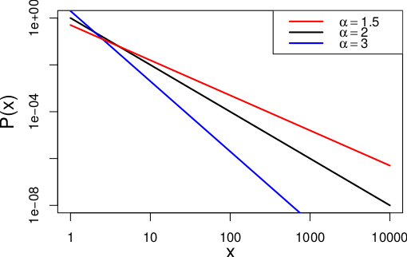
```

---

# Log-log plots of degree distributions

.pull-left[
```{r, echo=FALSE, out.width=650, fig.align='center'}

```
]

.pull-right[
```{r, echo=FALSE, out.width=650, fig.align='center'}
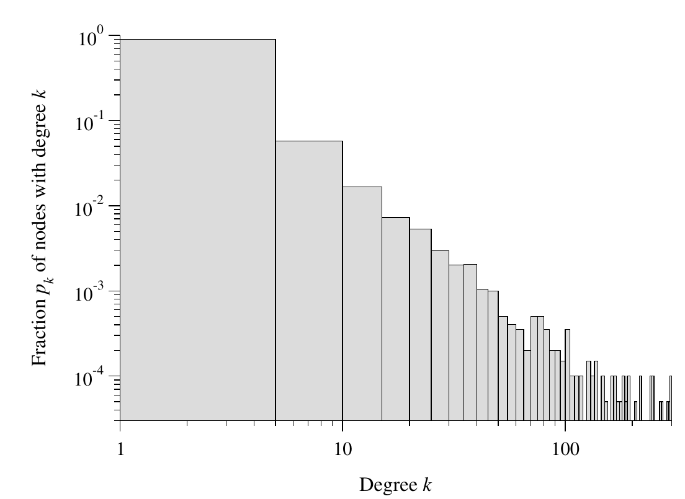
```
]

Two histograms of the same degree distribution. The second one has log-transformed x and y axes and the same bins.
---


# Logarithmic binning

```{r, echo=FALSE, out.width=630, fig.align='center'}
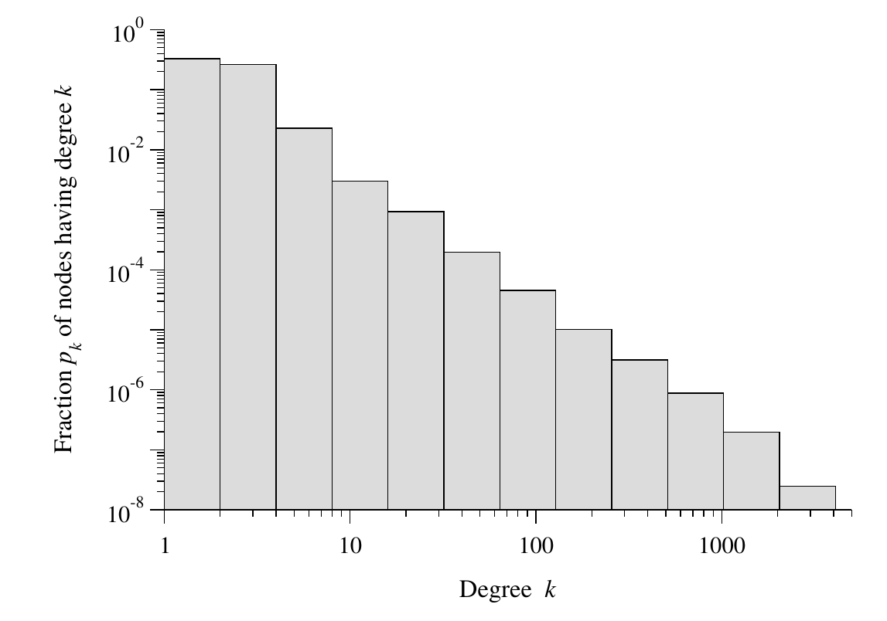
```
Same log-log histogram but with logarithmic binning: the width of a bin is a multiple of the one on the left. Bin heights are divided by their width.

---

# Power-law degree distribution examples

```{r, echo=FALSE, out.width=900, fig.align='center'}
knitr::include_graphics("Figures/Dists.png")
```
[Emergence of Scaling in Random Networks. Barabási & Albert. Science (1999)](https://www.science.org/doi/full/10.1126/science.286.5439.509)
---

# The scale-free property


Power-law distributions are of the form:
$$P(x) \propto x^{-\alpha}$$  
If we multiply the random variable by a constant, the distribution is just multiplied too
$$P(Cx) = C^{-\alpha} P(x)$$
**Scale-free property:** The shape of the distribution is the same across different scales of the variable

---
# Fractals and the scale-free property

```{r, echo=FALSE, out.width=500, fig.align='center'}
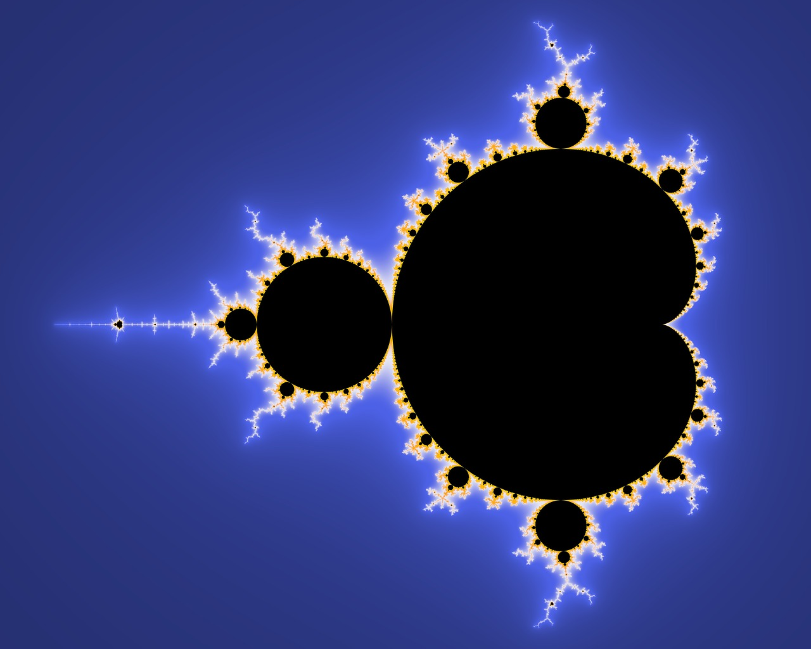
```

- Fractals are scale-free: they look similar when you zoom in and out 
- Sometimes it is also referred as self-similarity

---

# Diverging moments

The mean (first moment) and the variance (second moment) of a power law $P(x) \propto x^{-\alpha}$ might grow with sample size.
.pull-left[
- If $\alpha \leq 2$ the mean grows with sample size
  - The larger the sample, the larger the mean
- If $\alpha \leq 3$ the variance grows with sample size
  - The larger the sample, the values become more unequal and more disperse
- Figures: example with $\alpha=1.5$

]
.pull-right[
```{r, echo=FALSE, out.width=500, fig.align='center'}
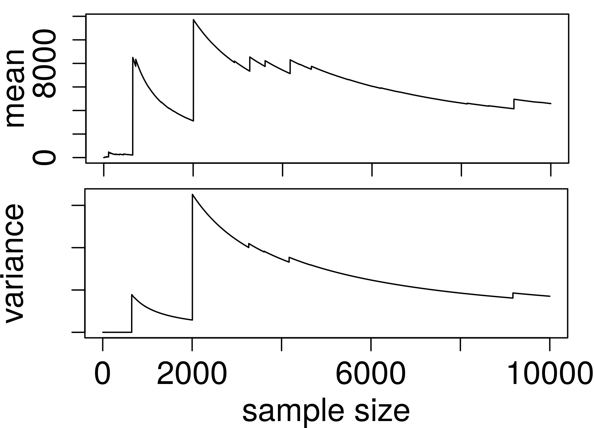
```
]

---

# The Barabási-Albert model

## 1. Power laws

## *2. The Barabási-Albert model*

## 3. The Vertex copying model

## 4. Network data sources

---

# Poisson degree distributions vs data

```{r, echo=FALSE, out.width=500, fig.align='center'}
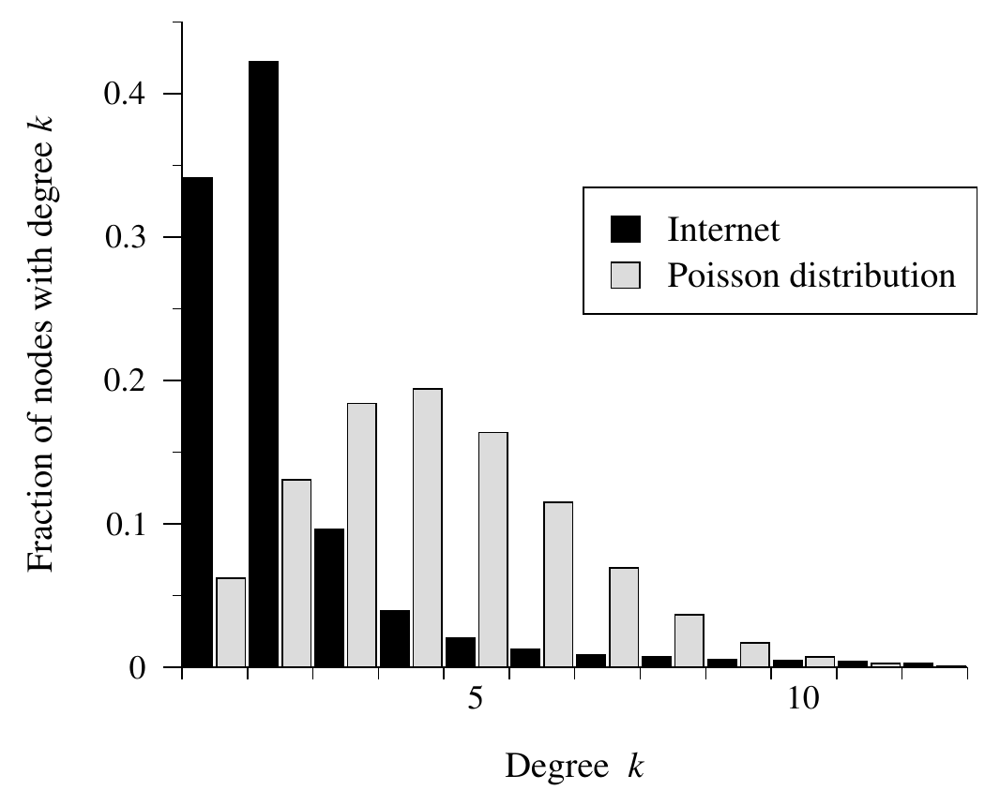
```

$G(n,m)$ produces Poisson degree distributions, not power-laws. Similar problems with the Watts-Strogatz small world model.


---

# The Barabási-Albert model

Mechanisms in the model:

- **Growth:** stating from an empty network, add one node at each iteration

- **Preferential attachment:** when a node is added, connect it to $m$ neighbors chosen at random in the network. Neighbors to connect are chosen with probability proportional to their degree. 

The probability $\Pi$ that a new vertex will be connected to vertex $i$ with degree $k_i$  is 

$$ \Pi(k_i) = \frac{k_i}{\sum_j k_j} $$

Online simulation of the BA model: https://sarah37.github.io/barabasialbert/

---

# Degree distribution in the BA model

.pull-left[
```{r, echo=FALSE, out.width=440, fig.align='center'}
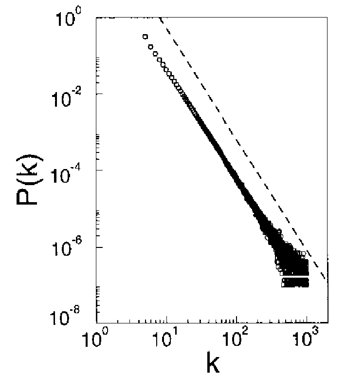
```
]

.pull-right[

- Degree distribution of simulations with $m=5$ for t=150,000 and t=200,000 (circles and squares, indistinguishable)

- Line has slope -2.9 in log-log plot

- The degree distribution in the BA model follows a power-law distributuion with $\alpha=3$: 

$$ P(x) = \frac{2m^2}{x^3} \propto x^{-3} $$
]

---

# Necessary conditions

.pull-left[
```{r, echo=FALSE, out.width=420, fig.align='center'}
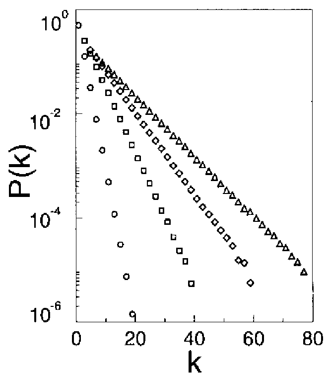
```
]

.pull-right[

- Growth without preferential attachment leads to Poisson distributions (x axis is not log-transformed)

- Plot shows growth without preferential attachment for various $m$ values

- Preferential attachment without growth leads to a full network

- Model is **minimal** to explain power-law degree distributions

]

---

# The rich-get-richer effect

.pull-left[
```{r, echo=FALSE, out.width=400, fig.align='center'}
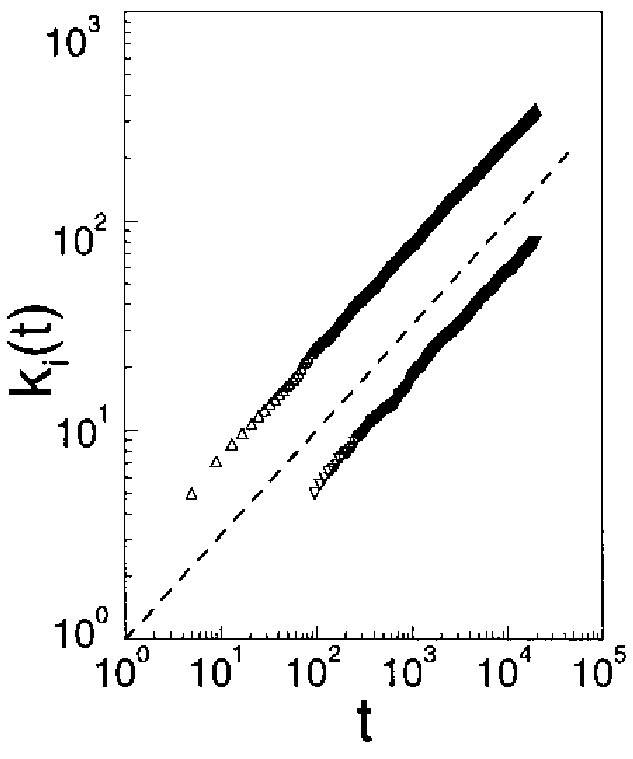
```
]

.pull-right[

- Diagram of degree versus time for two nodes inserted at different times in the simulation

- Age and degree are very strongly correlated

- Similar model previously studied by Herbert Simon in the 1960s for income distributions

- Model also previously discovered for citation networks in 1976 by Derek de Solla Price

]

---

# The Vertex copying model

## 1. Power laws

## 2. The Barabási-Albert model

## *3. The Vertex copying model*

## 4. Network data sources

---

## Global information and referential attachment

Remember the preferential attachment rule: The probability $\Pi$ that a new vertex will be connected to vertex $i$ with degree $k_i$  is 

$$ \Pi(k_i) = \frac{k_i}{\sum_j k_j} $$

The preferential attachment rule of the BA model assumes that nodes have access to global degree information and choose proportionally. Especially you need to know the sum of degrees in the denominator

This is implausible for many social systems: new actors don't know the network connecting actors, new social media users don't know the number of friends of others, new school students neither, etc.

---

# The vertex copying model
.pull-left[
```{r, echo=FALSE, out.width=500, fig.align='center'}
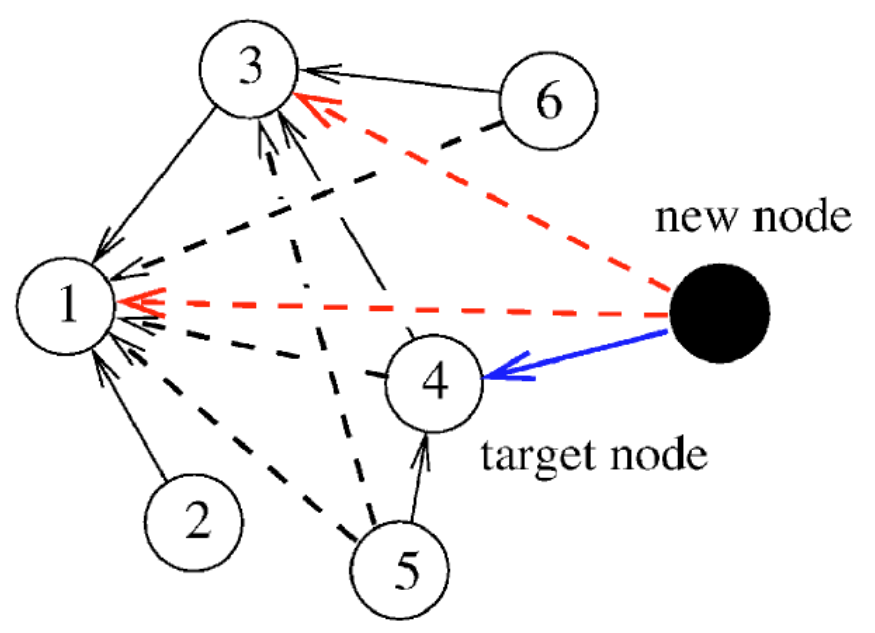
```
]

.pull-right[
- Start with one node and grow one node at a time

- When a new node connects, it samples one node at random and connects to it

- Then it copies all edges to neighbors of that node

- Some versions copy only a random fraction R of neighbors
]
Network growth by copying. P. L. Krapivsky and S. Redner. Physical Review E (2005)


---

## Copying implies growing degrees with time

.pull-left[
```{r, echo=FALSE, out.width=500, fig.align='center'}
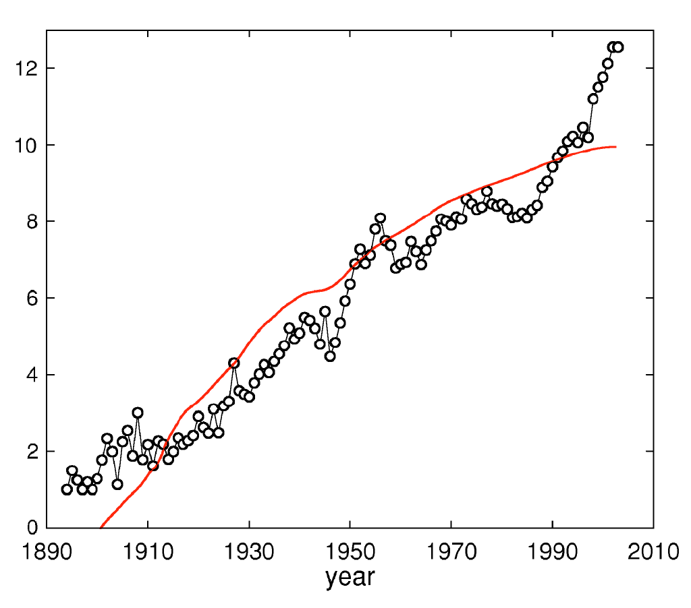
```
]
.pull-right[
- Average number of references in the reference list of Physical Review papers published in each year

-  Red curve is the logarithm of the cumulative number of Physical Review papers that were published up to each year

- Degrees of new nodes grow with time (and logarithmically with network size)
]

---

# Vertex copying degree distribution


.pull-left[
```{r, echo=FALSE, out.width=500, fig.align='center'}
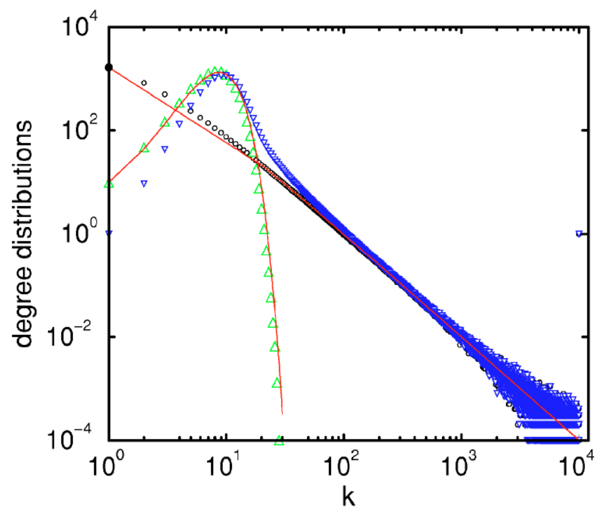
```
]
.pull-right[

- Edges are directed from the youngest to the oldest linked node

- In-degree distribution (blue) and out-degree distribution (green)

- In-degree distribution follows a power-law with $\alpha=2$

- Power-law generated with only random choice and local information

]

---

# 4. Network data sources

## 1. Power laws

## 2. The Barabási-Albert model

## 3. The Vertex copying model

## **4. Network data sources**

---

# Konect: The Koblenz Network Collection

```{r, echo=FALSE, out.width=935, fig.align='center'}
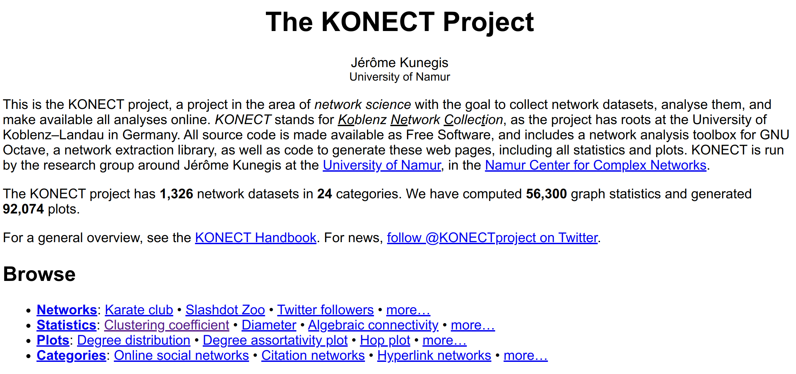
```

Handbook of Network Analysis. Jérôme Kunegis:http://konect.cc/

---

# Konect network statistics

```{r, echo=FALSE, out.width=950, fig.align='center'}
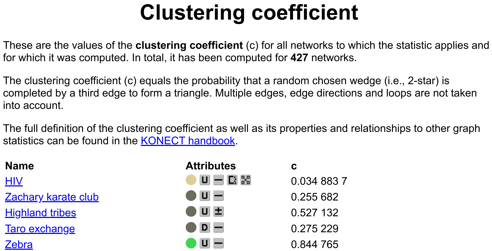
```

---

## Stanford Large Network Dataset Collection

```{r, echo=FALSE, out.width=1000, fig.align='center'}
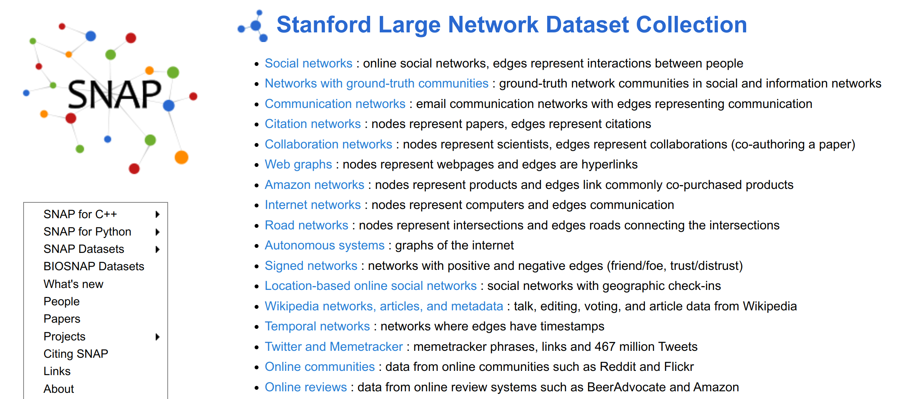
```

Available at: https://snap.stanford.edu/data/

---

# ICON: Index of Complex Networks

```{r, echo=FALSE, out.width=840, fig.align='center'}
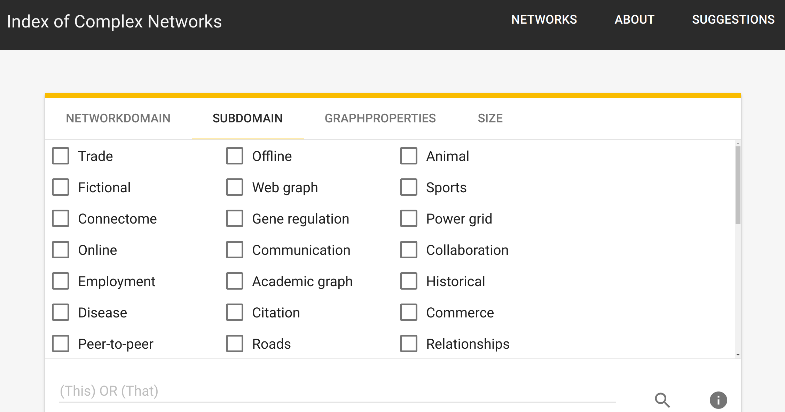
```

Available at: https://icon.colorado.edu/

---

# Analysis of degree distributions at scale

```{r, echo=FALSE, out.width=1200, fig.align='center'}
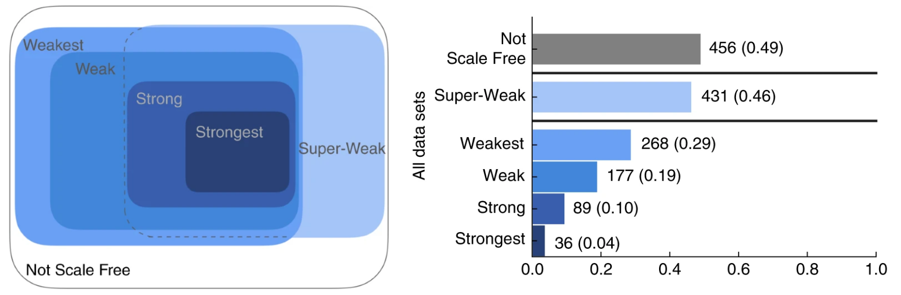
```

Analysis of the degree distribution of 928 networks from ICON.
[Scale-free networks are rare. A. Broido & A, Clauset. Nature Communications (2019)](https://www.nature.com/articles/s41467-019-08746-5)

---


## Summary

- Power laws
  - A property of degree distributions with high heterogeneity
  - scale-free property: the distribution is similar when networks are larger


- The Barabási-Albert model (complex networks)
  - Generates networks with power-law degree distributions 
  - Growth + preferential attachment


- The Vertex copying model
  - Growth where edges copy the links of a random existing edge
  - Generates power-law degree distributions with degree 2
  
  
- Network data sources
  - Many data sources in harmonized formats are out there
  - Use them in your project if you model networks!
  

---

# Quiz

- What kind of distribution is the degree distribution of $G(n,p)$?

- If a network has a degree distribution with exponent 2.5 and we double its size, can we expect a similar mean degree?

- If Twitter follower counts follow a power-law with exponent 2 and Twitter grows to double its size, what can we expect about the inequality in number of followers?

- Under what conditions is preferential attachment implausible?

- What is the exponent of the degree distribution of the vertex copying model?