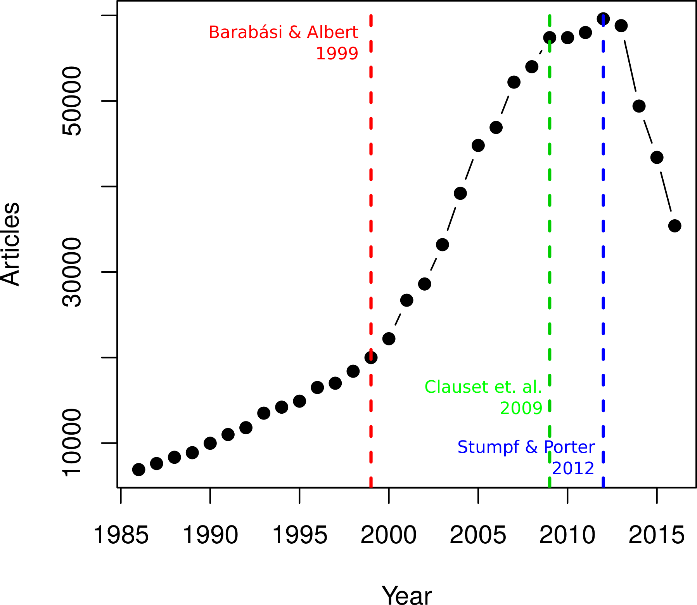
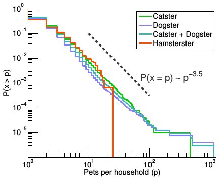
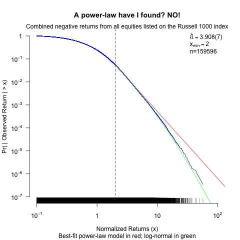

```{r xaringan-themer, include=FALSE, warning=FALSE}
#This block contains the theme configuration for the CSS lab slides style
library(xaringanthemer)
library(showtext)
style_mono_accent(
  base_color = "#5c5c5c",
  text_font_size = "1.5rem",
  header_font_google = google_font("Arial"),
  text_font_google   = google_font("Arial", "300", "300i"),
  code_font_google   = google_font("Fira Mono")
)
```

```{r setup, include=FALSE}
options(htmltools.dir.version = FALSE)
```

layout: true

<div class="my-footer"><span>David Garcia - Computational Modelling of Social Systems</span></div> 

---

## So far

- **Block 1: Fundamentals of agent-based modelling**
  - Basics of agent-based modelling: the micro-macro gap
  - Modelling segregation: Schelling's model
  - Modelling cultures


- **Block 2: Opinion dynamics**
  - Basics of spreading: Granovetter's threshold model
  - Opinion dynamics
  - Modelling hyperpolarization and cognitive balance


- **Block 3: Fundamentals of agent-based modelling**
  - Basic network models
  - Modelling small worlds
  - **Today: Scale-free networks**
  - Growth processes

---

# Overview

## 1. Power laws

## 2. The Barabási-Albert model

## 3. The Vertex copying model

## 4. Fitting power laws

---


# Power laws

## *1. Power laws*

## 2. The Barabási-Albert model

## 3. The Vertex copying model

## 4. Fitting power laws

---

# With big data comes big heterogeneity
.pull-left[
```{r, echo=FALSE, out.width=500, fig.align='center'}
knitr::include_graphics("Figures/CAIDA.png")
```
Network visualization of the physical Internet (K. C. Claffy, CAIDA).
]

.pull-right[
```{r, echo=FALSE, out.width=450, fig.align='center'}
knitr::include_graphics("Figures/Friendster.png")
```
Network visualization of Friendster
]
---

# Reminder: Node degree

A node's **degree** measures the number of links connected to it. 

In undirected networks there is only one measure of degree $k_i$, which is exactly the number of edges connected to the node $i$. 

In directed networks there are two kinds of degree: 
- **in-degree** $k_{in}(i)$ that is the number of edges ending in $i$, i.e. $(j,i)$
- **out-degree** $k_{out}(i)$ that is the number of edges leaving from $i$, i.e. $(i,j)$. In the first network example above, $k_{in}(c) = 1$ and $k_{out}(c) = 2$.

In weighted networks, **weighted node degrees** are sums of incoming and outgoing link weights. This way there are two weighted node degrees, the weighted in-degree and the weighted out-degree.

---

# Degree distribution

.pull-left[

The degree distribution $P(k)$ of a network measures the relative frequency of degree $k$ among the nodes of the network.

In the example:
- $P(0)=0$
- $P(1)=1/5$
- $P(2)=1/5$
- $P(3)=3/5$
- $P(4)=0$
]

.pull-right[
```{r, echo=FALSE, out.width=450, fig.align='center'}
knitr::include_graphics("Figures/networkUndirected.png")
```
]

---

# Histogram showing a degree distribution

```{r, echo=FALSE, out.width=650, fig.align='center'}
knitr::include_graphics("Figures/Hist.png")
```
Degree distribution of the physical internet (Newman, Ed.2, Chapter 10.3)
---

# Observing inequality: power-laws
```{r, echo=FALSE, out.width=650, fig.align='center'}
knitr::include_graphics("Figures/IncomeDistribution.png")
```

The Pareto Principle (80/20 rule): 20% of the people make 80% of the money

---
# Power-law distributions

- **Probability Density Function (PDF)**: $P(x)$ or $P(X=x)$
- Relative likelihood that the value of the random variable $X$ will be equal to $x$
- Power-law PDF: $P(x) = \frac{\alpha-1}{{x_{min}}} \left ( \frac{x}{x_{min}} \right )^{-\alpha}$  or for shorter: $P(x)  \propto  x^{-\alpha}$
- Look like lines of slope $-\alpha$ in log-log plots  

```{r, echo=FALSE, out.width=490, fig.align='center'}
knitr::include_graphics("Figures/powerLawPDF.png")
```

---

# Power-law degree distribution examples

```{r, echo=FALSE, out.width=900, fig.align='center'}
knitr::include_graphics("Figures/Dists.png")
```

---

# The scale-free property


Power-law distributions are of the form:
$$P(x) \propto x^{-\alpha}$$  
If we multiply the random variable by a constant, the distribution is just multiplied too
$$P(Cx) = C^{-\alpha} P(x)$$
**Scale-free property:** The shape of the distribution is the same across different scales of the variable

---
# Fractals and the scale-free property

```{r, echo=FALSE, out.width=500, fig.align='center'}
knitr::include_graphics("Figures/Fractal.jpg")
```

- Fractals are scale-free: they look similar when you zoom in and out 
- Sometimes it is also referred as self-similarity

---

# Diverging moments

The mean (first moment) and the variance (second moment) of a power law $P(x) \propto x^{-\alpha}$ might grow with sample size.
.pull-left[
- If $\alpha \leq 2$ the mean grows with sample size
  - The larger the sample, the larger the mean
- If $\alpha \leq 3$ the variance grows with sample size
  - The larger the sample, the values become more unequal and more disperse
- Figures: example with $\alpha=1.5$

]
.pull-right[
```{r, echo=FALSE, out.width=500, fig.align='center'}
knitr::include_graphics("Figures/Moments.png")
```
]

---

# The Barabási-Albert model

## 1. Power laws

## *2. The Barabási-Albert model*

## 3. The Vertex copying model

## 4. Fitting power laws

---

- ER and WS fail to get degree distributions
- lack of growth and heterogeneity or preference in linking
- Growth and preferential attachment
- Degree distribution -> gamma=3
- Growth without preferential attachment (fig 2b)
- Preferential attachment without growth (full net)
- A.K.A. Simon model, rich-get-richer (age effect)
- Issue: global information

---

# The Vertex copying model

## 1. Power laws

## 2. The Barabási-Albert model

## *3. The Vertex copying model*

## 4. Fitting power laws

---


- Rules: connect to a random node, copy its connections
	Alternative copies fraction of R connections
- Phys Rev case (Fig 3)
- In-degree distribution as power law exp 2
- Fig 6
- Comment: based on local information only it generates power-law

---

# Fitting power laws

## 1. Power laws

## 2. The Barabási-Albert model

## 3. The Vertex copying model

## *4. Fitting power laws*

---

# The power-law scientific fad


.pull-left[
```{r, echo=FALSE, out.width=500, fig.align='center'}

```
Google scholar trend for "power law"
]
.pull-right[
Along the 20th century, interest in power-laws was moderately increasing
- In 1999, Barabási & Albert published their famous model
- The amount of papers with power-laws accelarated
- Two papers in 2009 and 2012 showed that power-laws are hard to test
- The amount of papers claiming power-laws is decreasing very fast
]
---

- **Cumulative Distribution Function (CDF)**: $F_X(x) = P(X \leqslant x)$
  -  Probability that $X$ will be less than or equal to x. It is the area under the PDF from $-\infty$ to x 
- **Complementary CDF (CCDF)**: $\overline{F_X}(x) = 1- F_X(x) = P(X > x)$

---

# The hamster power law

```{r, echo=FALSE, out.width=550, fig.align='center'}

```

CCDF of the number of pets per household in "pet social media"

---

# Power-law or log-normal?

Power-law and log-normal distributions can look very
similar to each other
• Only at the tail of the CCDF there is a large difference
• Example: Returns of stock prices in the stock exchange
• Thought to be power-law for many years
• A log-normal distribution is a much better model
• Still having a fat tail, but not scale-free
• Strumpf & Porter’s rule of thumb: If the line fits for
less than two orders of magnitude, it’s not a power-law

Not every distribution that looks like a line is a power-law


```{r, echo=FALSE, out.width=550, fig.align='center'}

```
---

- Ref to Clauset 1: MLE
- Ref to Clauset 2: rarer than thought

- [Power-law distributions in empirical data. Aaron Clauset, Cosma Rohilla Shalizi, M. E. J. Newman. SIAM review (2009)](https://epubs.siam.org/doi/pdf/10.1137/070710111?casa_token=hnVnLw3C7gIAAAAA:w2d60SzJl4xl7LXDoMhqr0wlCOOcpbxaoYdPto9jWC1fxK1Ogue3BiHW8DR8sv7hVkdd46Ec-z4)


---

## Summary

- Power laws
  -
  -

- The Barabási-Albert model
  -
  -

- The Vertex copying model
  -
  -
  
- Fitting power laws
  -
  -
  

---

# Quiz

---