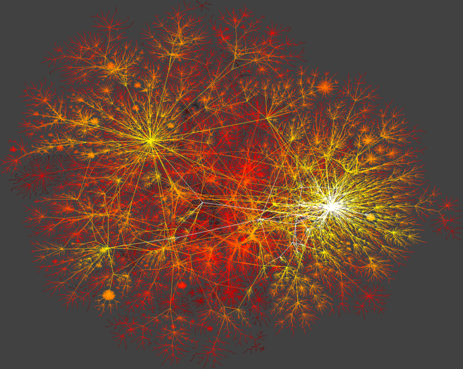
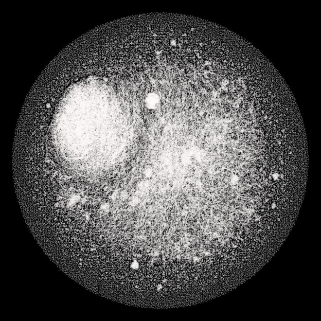
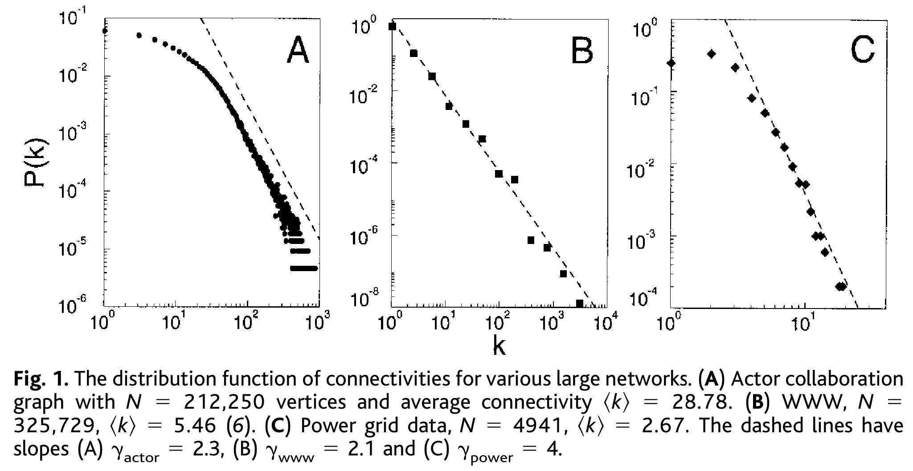

```{r xaringan-themer, include=FALSE, warning=FALSE}
#This block contains the theme configuration for the CSS lab slides style
library(xaringanthemer)
library(showtext)
style_mono_accent(
  base_color = "#5c5c5c",
  text_font_size = "1.5rem",
  header_font_google = google_font("Arial"),
  text_font_google   = google_font("Arial", "300", "300i"),
  code_font_google   = google_font("Fira Mono")
)
```

```{r setup, include=FALSE}
options(htmltools.dir.version = FALSE)
```

layout: true

<div class="my-footer"><span>David Garcia - Computational Modelling of Social Systems</span></div> 

---

## So far

- **Block 1: Fundamentals of agent-based modelling**
  - Basics of agent-based modelling: the micro-macro gap
  - Modelling segregation: Schelling's model
  - Modelling cultures


- **Block 2: Opinion dynamics**
  - Basics of spreading: Granovetter's threshold model
  - Opinion dynamics
  - Modelling hyperpolarization and cognitive balance


- **Block 3: Fundamentals of agent-based modelling**
  - Basic network models
  - Modelling small worlds
  - **Today: Scale-free networks**
  - Growth processes

---

# Overview

## 1. Power laws

## 2. The Barabási-Albert model

## 3. The Vertex copying model

## 4. Fitting power laws

---


# Power laws

## *1. Power laws*

## 2. The Barabási-Albert model

## 3. The Vertex copying model

## 4. Fitting power laws

---

# With big data comes big heterogeneity
.pull-left[
```{r, echo=FALSE, out.width=500, fig.align='center'}

```
Network visualization of the physical Internet (K. C. Claffy, CAIDA).
]

.pull-left[
```{r, echo=FALSE, out.width=450, fig.align='center'}

```
Network visualization of Friendster
]
---

# Reminder: Node degree

A node's **degree** measures the number of links connected to it. 

In undirected networks there is only one measure of degree $d(i)$, which is exactly the number of edges connected to the node $i$. 

In directed networks there are two kinds of degree: 
- **in-degree** $d_{in}(i)$ that is the number of edges ending in $i$, i.e. $(j,i)$
- **out-degree** $d_{out}(i)$ that is the number of edges leaving from $i$, i.e. $(i,j)$. In the first network example above, $d_{in}(c) = 1$ and $d_{out}(c) = 2$.

In weighted networks, **weighted node degrees** are sums of incoming and outgoing link weights. This way there are two weighted node degrees, the weighted in-degree and the weighted out-degree.

---

- Degree distribution / histogram

---

# Power-law degree distribution examples

```{r, echo=FALSE, out.width=900, fig.align='center'}

```

---

# Power laws and power-law distributions

---

## Density functions of power-law distributions

---

# The scale-free property

---

# Diverging moments

---

# The Barabási-Albert model

## 1. Power laws

## *2. The Barabási-Albert model*

## 3. The Vertex copying model

## 4. Fitting power laws

---

- ER and WS fail to get degree distributions
- lack of growth and heterogeneity or preference in linking
- Growth and preferential attachment
- Degree distribution -> gamma=3
- Growth without preferential attachment (fig 2b)
- Preferential attachment without growth (full net)
- A.K.A. Simon model, rich-get-richer (age effect)
- Issue: global information

---

# The Vertex copying model

## 1. Power laws

## 2. The Barabási-Albert model

## *3. The Vertex copying model*

## 4. Fitting power laws

---


- Rules: connect to a random node, copy its connections
	Alternative copies fraction of R connections
- Phys Rev case (Fig 3)
- In-degree distribution as power law exp 2
- Fig 6
- Comment: based on local information only it generates power-law

---

# Fitting power laws

## 1. Power laws

## 2. The Barabási-Albert model

## 3. The Vertex copying model

## *4. Fitting power laws*

---

- The power-law fad
- Hamster power-law
- Power-law vs log-normal
- Ref to Clauset 1: MLE
- Ref to Clauset 2: rarer than thought


---

## Summary

- Power laws
  -
  -

- The Barabási-Albert model
  -
  -

- The Vertex copying model
  -
  -
  
- Fitting power laws
  -
  -
  

---

# Quiz

---