```{r xaringan-themer, include=FALSE, warning=FALSE}
#This block contains the theme configuration for the CSS lab slides style
library(xaringanthemer)
library(showtext)
style_mono_accent(
  base_color = "#5c5c5c",
  text_font_size = "1.5rem",
  header_font_google = google_font("Arial"),
  text_font_google   = google_font("Arial", "300", "300i"),
  code_font_google   = google_font("Fira Mono")
)
```

```{r setup, include=FALSE}
options(htmltools.dir.version = FALSE)
```

layout: true

<div class="my-footer"><span>David Garcia - Computational Modelling of Social Systems</span></div> 

---

## So far

- **Block 1: Fundamentals of agent-based modelling**

- **Block 2: Opinion dynamics**

- **Block 3: Network formation**


- **Block 4: Behavior on networks**

  - **Today: Growth processes and spreading in networks**

  - *No class on 26.05.2022: Ascension day*

  - 02.06: Modelling epidemics: the SEIRX model

- 09.06: Lecture Q&A session 

---

# Overview

## 1. Collective aggregation: long and fat tails
## 2. Growth processes
## 3. Spreading models
## 4. Spreading in networks

---

#  Collective aggregation: long and fat tails

## *1. Collective aggregation: long and fat tails*
## 2. Growth processes
## 3. Spreading models
## 4. Spreading in networks

---

# Collective Aggregation

.pull-left[
Traces of human behavior can aggregate at large scales

Example: Monte Testaccio in Rome

Made of ancient remains of clay vases (est. ∼ 53 Million amphorae)

Collectively produced by a large group of people

Individual contributions might be indistinguishable
(or irrelevant)
]
.pull-right[
```{r, echo=FALSE, out.width=500, fig.align='center'}

```
]

---

##  Collective aggregation examples


```{r, echo=FALSE, out.width=800, fig.align='center'}
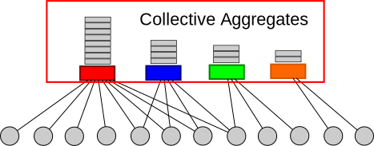
```


Examples of online aggregates: views in YouTube videos, ratings for Amazon products, searches for a term in Google...

Examples of offline aggregates: population of cities, number of people with a disease, number of people who bought a product...

---


## Properties of collective aggregation: The fat tail

**Fat tail behavior:** The existence of few objects with a very large aggregated size

.pull-left[
```{r, echo=FALSE, out.width=500, fig.align='center'}
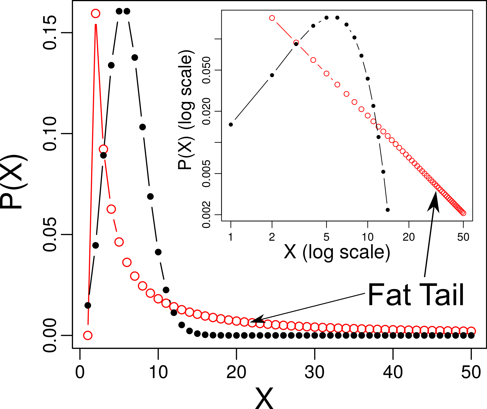
```
]

.pull-right[
- Fat tails can be seen in the probability density function (PDF)

- Using log-log scales, the Fat tail is easier to see

- The probability of extremely large events is not
negligible
]

---

## Reminder: Fat-tail examples

```{r, echo=FALSE, out.width=900, fig.align='center'}
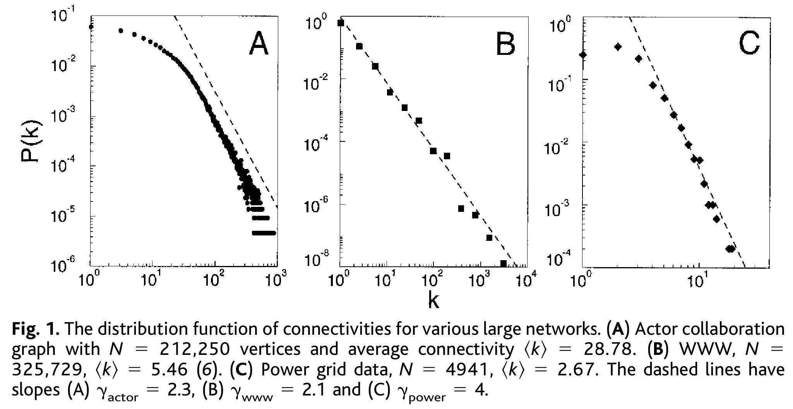
```
[Emergence of Scaling in Random Networks. Barabási & Albert. Science (1999)](https://www.science.org/doi/full/10.1126/science.286.5439.509)

---


## Properties of collective aggregation: The long tail

```{r, echo=FALSE, out.width=550, fig.align='center'}
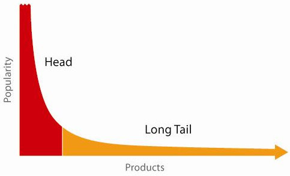
```
Long tail behavior: The existence of many objects with a small aggregated size
- Can be seen in the size sequence, also known as rank-size plot
- Example with products: collective aggregate size is amount of sold units
- The long tail can account for a very large fraction of the total area of the curve 

---

# Examples of long tails

.pull-left[
```{r, echo=FALSE, out.width=580, fig.align='center'}
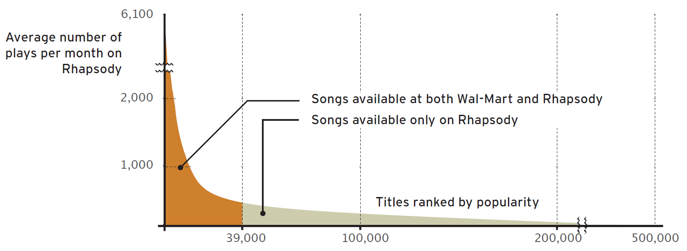
```

```{r, echo=FALSE, out.width=470, fig.align='center'}
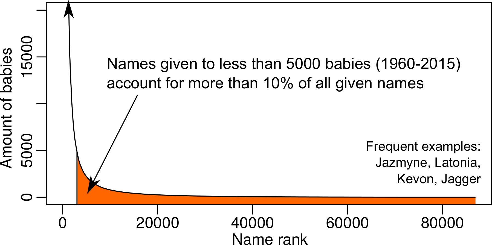
```
]
.pull-right[

Songs in Rhapsody.com
- Song in Wal-Mart do not have a
long tail due to finite shelf size
- Songs only available in Rhapsody
account for 22% of the sales


Baby names in the US (1960-2015)
- A large amount of names is given
to very few babies
- The amount of babies per name
displays long tail behavior
]

---
# Long and fat tails


A long tail:
- appears on the right tail of the size sequence
- shows the existence of frequent cases of small aggregates

A fat tail:
- appears on the right tail of the probability density function (PDF)
- shows the probability of extremely large aggregates

Different but non-exclusive phenomena:
- A high head of the size sequence is a fat tail of the PDF
- Sometimes are confused in the literature!


---

# Growth processes
## 1. Collective aggregation: long and fat tails
## *2. Growth processes*
## 3. Spreading models
## 4. Spreading in networks

[A Brief History of Generative Models for Power Law and Lognormal Distributions. Michael Mitzenmacher. Internet Mathematics (2004)](https://www.eecs.harvard.edu/~michaelm/postscripts/im2004a.pdf)
---


#When aggregates change over time
Growth Process: The dynamics driving how size changes over time

Sometimes they strictly grow (e.g. total views of a video) or might decrease (e.g. social media users)

.pull-left[
We will study three types of growth processes for collective aggregates:
- **Additive growth**
- **Multiplicative growth with fixed age**
- **Multiplicative growth with heterogeneous ages**
]

.pull-right[
```{r, echo=FALSE, out.width=400, fig.align='center'}

```
]

---

# Additive growth

.pull-left[
An additive growth process has a growth rate that is independent of previous sizes:
$$    X_{t+1} = X_t + \gamma + \epsilon $$

-  $\gamma$ is the growth rate (change in units over time)
-  $\epsilon$ is the stochastic term (e.g. $\sim N(0,1)$)

The figure shows the simulation of $100$ additive growth processes with $\gamma=1$ and $\epsilon \sim N(0,1)$
]
.pull-right[
```{r, echo=FALSE, out.width=480, fig.align='center'}
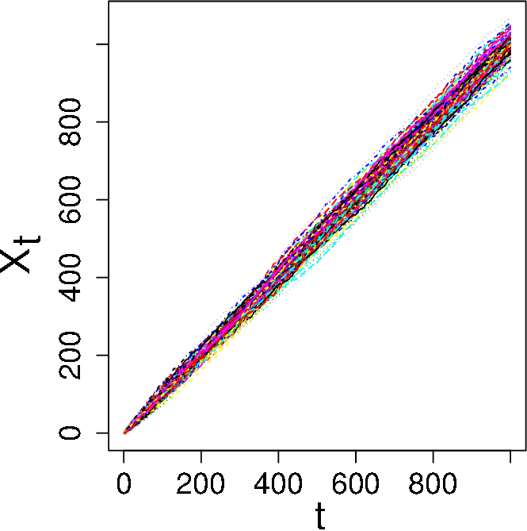
```
]

---
  

# Size distribution under additive growth

Additive growth processes produce aggregate sizes that follow a normal distribution:
$$ N(\mu, \sigma^2): P(x) = \frac{1}{\sigma \sqrt{2 \pi}} exp(-\frac{(x - \mu)^2}{2\sigma^2})   $$

.pull-left[
- The figure shows the size distribution (PDF) after the simulation of $10000$ processes as in the previous slide
- Individual aggregation tends to follow additive growth
- For example: a persons height
]
.pull-right[
```{r, echo=FALSE, out.width=300, fig.align='center'}
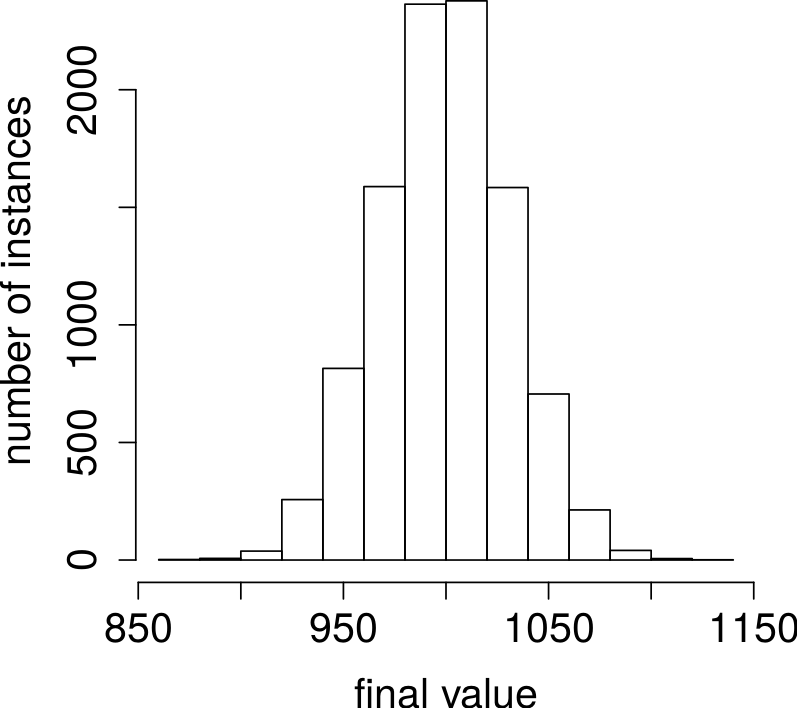
```
]


---


# Multiplicative growth

Multiplicative growth processes have a growth rate proportional to the previous size.
It follows the following equation:

$$X_{t+1} = X_t + \gamma * \epsilon * X_t$$
.pull-left[
- $\gamma$ is the proportional growth rate (\% change over time)
- $\epsilon$ is the stochastic term (e.g. $\sim N(1,1)$)
- The figure shows the simulation of $100$ multiplicative growth processes with $\gamma= 0.01$ and $\epsilon \sim N(1,1)$
]
.pull-right[
```{r, echo=FALSE, out.width=350, fig.align='center'}
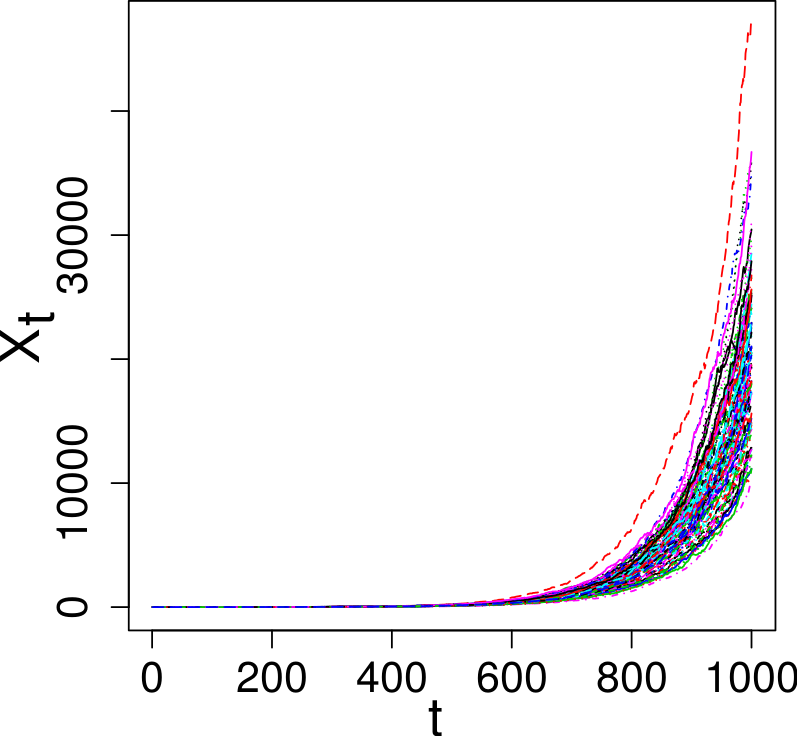
```
]
---

## Sized under multiplicative growth with fixed age
  
Multiplicative growth processes with fixed age produce aggregate sizes that follow a 
log-normal distribution: $lnN(\mu, \sigma^2): P(x) = \frac{1}{x\sigma \sqrt{2 \pi}} exp(-\frac{(ln(x) - \mu)^2}{2\sigma^2}  )$

.pull-left[

- Final size distribution in $10000$ simulations with the same ages

- If $X$ follows a log-normal distribution, then $log(X)$ approximately follows a normal distribution
]

.pull-right[
```{r, echo=FALSE, out.width=390, fig.align='center'}
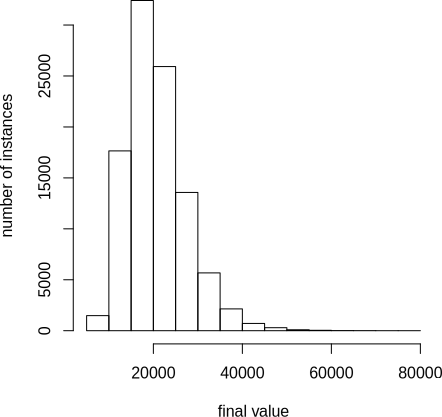
```
]

---

## Multiplicative growth with heterogeneous ages

.pull-left[

- Multiplicative growth the same way:

$$X_{t+1} = X_t + \gamma * \epsilon * X_t$$

- A Poisson birth process produces new elements at a constant rate

- In that case objects have heterogeneous ages

- Inset: vertical axis is log-transformed
 ]
 
.pull-right[

```{r, echo=FALSE, out.width=500, fig.align='center'}
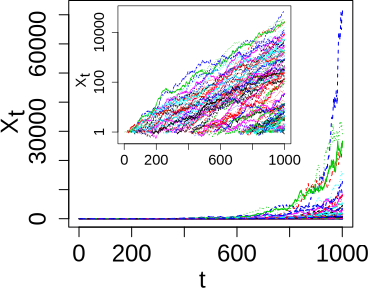
```

]

---

# Power-law size distributions 

- Multiplicative growth processes with Poisson birth  produce aggregate sizes that follow a  power-law distribution:

$pl(\alpha, x_{min}): P(x) \propto x^{-\alpha}$ for $x\geq x_{min}$, otherwise $0$ 

.pull-left[
- Results of simulating $100$ processes with $\gamma=0.01$, 

- Final size distribution (PDF) appears as a straight line towards the lower right corner in a log-log plot
]
.pull-right[
```{r, echo=FALSE, out.width=400, fig.align='center'}
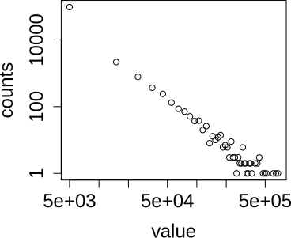
```
]
---

# Novelty decay in online communities
.pull-left[ 
The three properties of online collective aggregation:

- **Multiplicative growth:**  Each new element in the aggregate can bring new ones

- **Heterogeneous ages:** Objects are produced in different moments of time

- **Novelty decay:** Growth rates are not constant over time, they decrease very fast
 

]

.pull-right[
```{r, echo=FALSE, out.width=400, fig.align='center'}
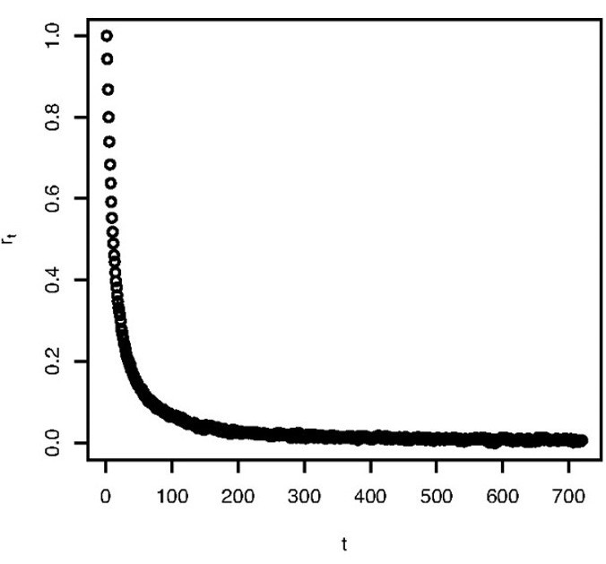
```

Growth rate versus age in Digg submissions
]
---


# Novelty decay in online communities
.pull-left[ 

Novelty decay bounds growth lifespan: similar to fixed ages

Online aggregates tend to follow log-normal distributions
 - tweets with a hashtag, views of YouTube videos, Digg votes for links...
  - E.g. digg votes log-normal distribution

[Fang Wu and Bernardo A. Huberman: Novelty and collective attention](https://www.ncbi.nlm.nih.gov/pmc/articles/PMC2077036/)

]

.pull-right[
```{r, echo=FALSE, out.width=500, fig.align='center'}
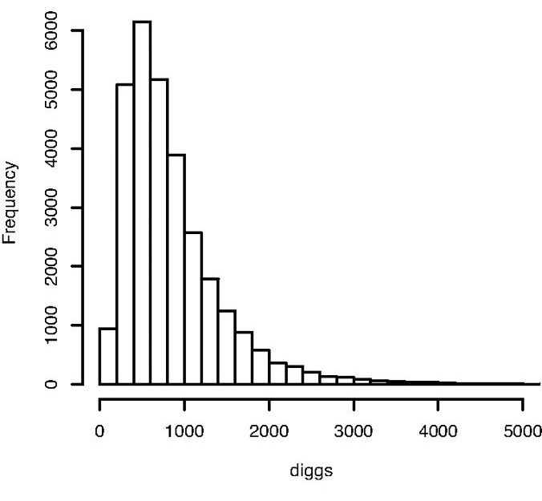
```
]
---


# Spreading models
## 1. Collective aggregation: long and fat tails
## 2. Growth processes
## *3. Spreading models*
## 4. Spreading in networks
---

# Compartmental models in epidemics

```{r, echo=FALSE, out.width=1000, fig.align='center'}
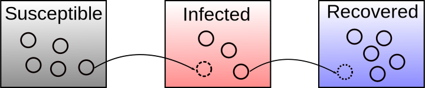
```

[Modeling Epidemics With Compartmental Models. Juliana Tolles and ThaiBinh Luong, JAMA Guide to Statistics and Methods (2020)](https://jamanetwork.com/journals/jama/fullarticle/2766672)

- Individuals are separated into *compartments* by their state of infection
- Individuals are indistinguishable within compartments
- Individuals transition between compartments when their state changes
- Not really Agent-Based Model: population or equation-based model

---

## The Susceptible-Infected-Recovered model (SIR)

- Three possible states:
  - **Susceptible**: not infected but could be infected and is behaving as usual
  - **Infected**: has disease, is contagious, and spreads disease
  - **Recovered**: not sick nor contagious any more

```{r, echo=FALSE, out.width=800, fig.align='center'}
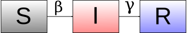
```

- Transitions between states:
  - From S to I: infection from another infected individual.
  - From I to R: recovery from disease, death, or permanent isolation such that individual cannot infect any other individual.
  - Transitions happen with rates $\beta$ and $\gamma$ respectively
  
---

# Transition equations in SIR model
.pull-left[

$$ \frac{dS}{dt} = - \frac{\beta IS}{N} $$

$$  \frac{dI}{dt} = \frac{\beta IS}{N} - \gamma I $$
$$ \frac{dR}{dt} =  \gamma I$$
]

.pull-right[

- Susceptibles diminish as they get Infected ( $\beta I S$ )
- Infected increase the same way and diminish at a rate $\gamma I$
- Recovered only increase from Infected
- Parameters are not just a biological property of the disease, also depend on density of contacts, treatment, quarantines...
]

The basic reproduction number $R_0=\frac{\beta}{\gamma}$ is the mean number of new infections caused by a single infected individual.

---

# Epidemic curves in SIR model

```{r, echo=FALSE, out.width=700, fig.align='center'}
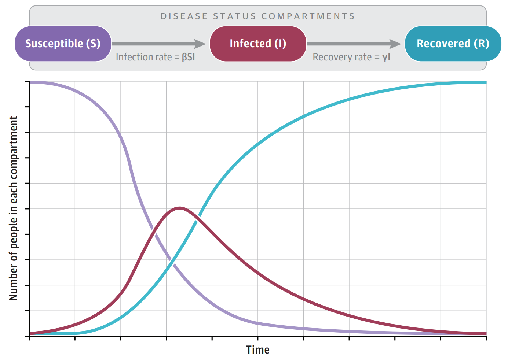
```

---

## The Susceptible-Infected-Susceptible model (SIS)

- Only two possible states:
  - **Susceptible**: not infected but could be infected and is behaving as usual
  - **Infected**: has disease, is contagious, and spreads disease

```{r, echo=FALSE, out.width=800, fig.align='center'}
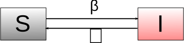
```

- Transitions between states:
  - From S to I: infection from another infected individual.
  - From I to S: recovery from disease but reinfection is possible
  - Transitions happen with rates $\beta$ and $\nu$ respectively
  
---

# Transition equations in SIS model

.pull-left[

$$ \frac{dS}{dt} = - \frac{\beta IS}{N} + \nu I$$

$$  \frac{dI}{dt} = \frac{\beta IS}{N} - \nu I $$
]

.pull-right[

- Susceptibles diminish as they get Infected ( $\beta I S$ ) and increase from infected ( $\nu I$ )

- Infected increase the same way and diminish at a rate $\nu I$
]

- if $\beta \leq \nu$, the disease dies out and $I$ approaches zero over time

-  if $\beta \gt \nu$, then $I$ approaches $(1 - \frac{\nu}{\beta}) N$ over time

---

# Epidemic curves in SIS model ( $\beta > \nu$ )

```{r, echo=FALSE, out.width=650, fig.align='center'}
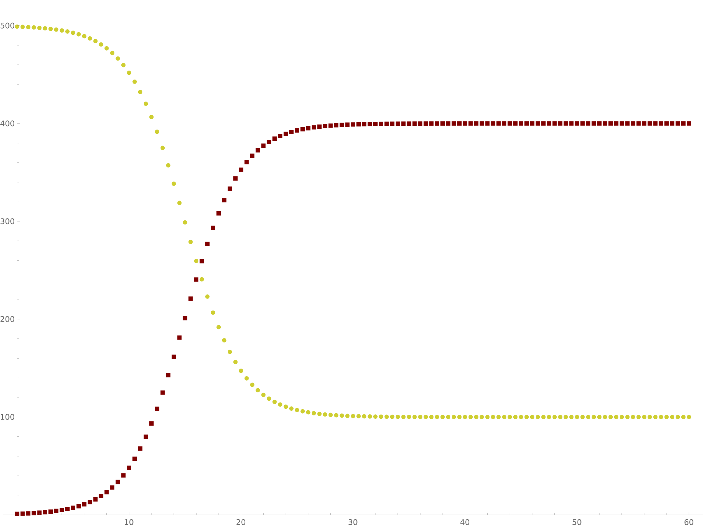
```

---


# Spreading in networks
## 1. Collective aggregation: long and fat tails
## 2. Growth processes
## 3. Spreading models
## *4. Spreading in networks*
---

# Network position and influence

.pull-left[

Which nodes are the most influential in a network?

- Viral marketing: optimising the reach of a marketing campaign
through social influence

- Cascade prevention: resilience against random failures and
targeted attacks

- Epidemic spreading: locating individuals that should be immunized
first
]
.pull-right[

```{r, echo=FALSE, out.width=450, fig.align='center'}
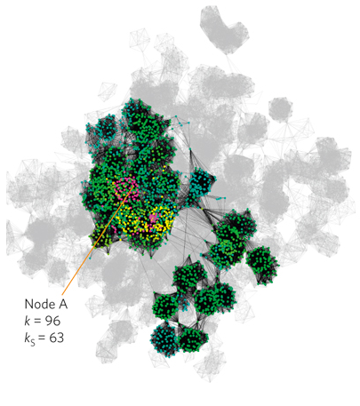
```
]

---

# Refresher: The k-core decomposition

The graph remaining after the cascade above is what is called a k-core

> **k-core**: A k-core of a graph $G$ is a maximal connected subgraph of $G$ in which all vertices have degree at least k.

For any network, you can calculate its k-core decomposition as follows:  

- Start with $k_s=1$  
- Remove all nodes with degree less than or equal to $k_s$ and their links  
- Repeat until all nodes have degree larger than $k_s$  
- Increase $k_s$ by one and repeat until no nodes are left

The nodes and the edges removed for certain of $k_s=k$ is called the **k-shell**.  
A **k-core** is the set of all k-shells with $k_s \geq k$  
Nodes have **coreness centrality** as the number of their k-core
---

# Spreading and centralities example

```{r, echo=FALSE, out.width=1000, fig.align='center'}
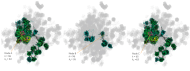
```

---

## Network centrality measures in simulations

Which centrality measure is the best to find nodes that create large cascades?


Comparison of the role of degree centrality $k$ and coreness centrality $k_s$

Average cascade sizes comparison:

$$M(k, k_s) = \sum_{i \in \Psi(k, k_s)} \frac{M_i}{N(k, k_s)}$$

- $M_i$ : average size of SIR simulated cascades starting at node $i$
- $\Psi(k, k_s)$ is the set of nodes with degree $k$ coreness $k_s$
- $N(k, k_s)$ is the number of nodes in $\Psi(k, k_s)$


---

# Results for a hospital network
.pull-left[

- Network data: Contacts in Swedish hospital
  - Nodes are patients
  - Edges connect patients that have been in the same room at the same time

- $M(k, k_s)$ for Swedish hospital patients

- Degree centrality cannot distinguish middle-sized and large cascades
]
.pull-right[
```{r, echo=FALSE, out.width=500, fig.align='center'}
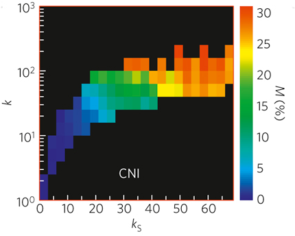
```
]
---


# Results for an adult movie network
.pull-left[

- $M(k, k_s)$ for actors of adult movies in IMDB

- Nodes are actors of adult movies in IMDB

- Edges connect actors who appear in the same
movie (disease spread risk)

- Similar result as for hospital
]
.pull-right[
```{r, echo=FALSE, out.width=500, fig.align='center'}
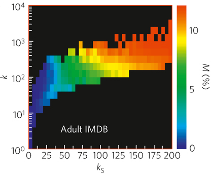
```
]
---


# Results for an online social network
.pull-left[

- Livejournal is a social network for blogs

- $M(k, k_s)$ of the users of Livejournal

- Nodes are users of Livejournal

- Edges exist between blogs that have links to
each other

- Cascades are information or behavior cascades
]
.pull-right[
```{r, echo=FALSE, out.width=500, fig.align='center'}
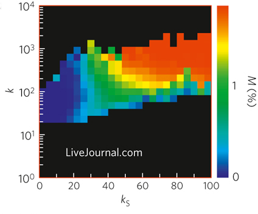
```
]

---

# A closer look to cascade distributions

.pull-left[

```{r, echo=FALSE, out.width=420, fig.align='center'}
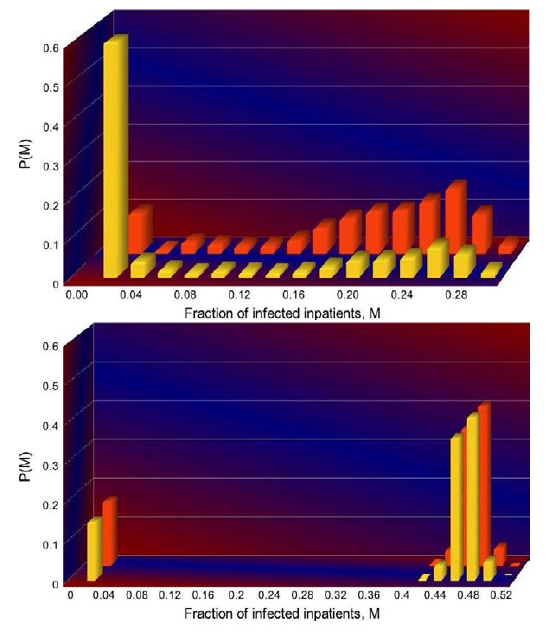
```
]

.pull-right[

- $k = 96$
- $k_s=63$ (orange) and $k_s=26$ (yellow)

- Lower: same histogram in a random network
with the same degree sequence

- Nodes with low coreness have high chances of
creating cascades of negligible size (cascade distributions are not unimodal)


]

---

## Summary
  - Collective aggregation
    - Fat tails: Extremely large sizes can happen
    - Long tails: Very small sizes are frequent


  - Growth processes
    - Additive and multiplicative growth
    - Heterogeneous ages + multiplicative growth: power-law aggregates


  - Spreading models
    - Compartments where agents are indistinguishable
    - Transition equations with parameters


  - Spreading in networks
    - Running SIR models on empirical network data
    - Degreee is not sufficient: the role of coreness
