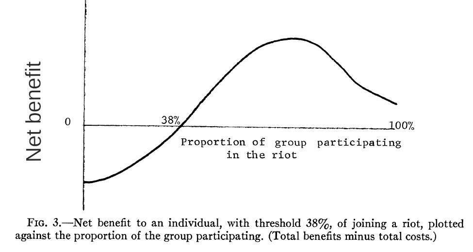
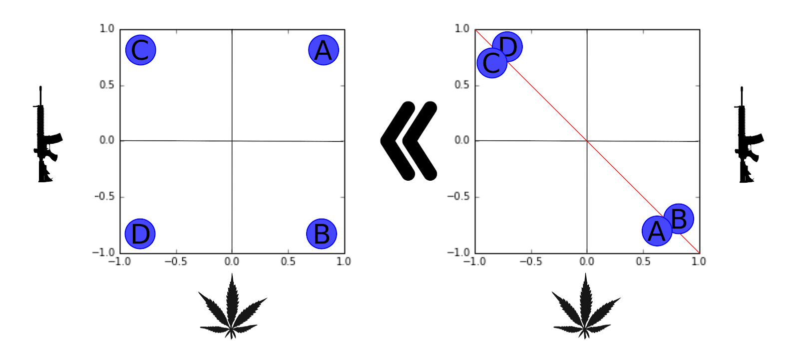

```{r xaringan-themer, include=FALSE, warning=FALSE}
#This block contains the theme configuration for the CSS lab slides style
library(xaringanthemer)
library(showtext)
style_mono_accent(
  base_color = "#5c5c5c",
  text_font_size = "1.5rem",
  header_font_google = google_font("Arial"),
  text_font_google   = google_font("Arial", "300", "300i"),
  code_font_google   = google_font("Fira Mono")
)
```

```{r setup, include=FALSE}
options(htmltools.dir.version = FALSE)
```

layout: true

<div class="my-footer"><span>David Garcia - Computational Modelling of Social Systems</span></div> 

---

# Course overview

- **Block 1: Fundamentals of Agent-Based Modelling**
  - Micro-macro gap
  - Segregation and culture
  
  
- **Block 2: Opinion dynamics**
  - Granovetter's spreading model
  - Voter models and bounded confidence


- **Block 3: Network formation**
  - Random graphs and phase transitions
  - Small Worlds and Scale-free networks


- **Block 4: Processes on networks**
  - Epidemic models: SIR
  - Epidemics in practice: SEIRX

---
  


# The macro-micro gap

```{r, echo=FALSE, out.width=900, fig.align='center'}
knitr::include_graphics("Figures/Boat.png")
```

*Causal Mechanisms in the Social Sciences. Peter Hedström and Petri Ylikoski. Annual Review of Sociology, 2010.*
---

## Interdisciplinarity in complex social behavior
```{r, echo=FALSE, out.width=1200, fig.align='center'}

```

---

# Kalick & Hamilton dating model

.pull-left[
```{r, echo=FALSE, out.width=400, fig.align='center'}

```
]
.pull-right[

- % matched couples for the case of preferring attractive partners

- Correlation starts low but raises pretty fast up to about 0.55, closer to empirical values than the matching attractiveness case

- **Main result:** attractiveness matching is not necessary for observed correlations

]

*The matching hypothesis reexamined. Michael Kalick and Thomas Hamilton. Journal of Personality and Social Psychology, 1986.*

---


# Schelling's segregation model

.pull-left[
```{r, echo=FALSE, out.width=350, fig.align='center'}
knitr::include_graphics("Figures/RND.png")
```
]

.pull-right[

- Agents are aware of the fraction of similar agents in their neighborhood: $f$


- Agents are satisfied with $f \geq F$, otherwise they relocate to a position in which they are satisfied
  - $F$ measures intolerance


- Outcome: Segregation measured with Moran's I

]

*Dynamic Models of Segregation. Thomas Schelling. Journal of Mathematical Sociology, 1971*
---


## Segregation versus tolerance in Schelling's model

.pull-left[
```{r, echo=FALSE, out.width=750, fig.align='center'}
knitr::include_graphics("Figures/IvsF.png")
```
]
.pull-right[

- 3x3 neighborhood (up to 8 neighbors), torus edges

- Boxplots of I after convergence in several simulations

- Moran's I stays low for low F values

- Sharp increase above two neighbors for F

- Substantial segregation for F>0.33

]
---


# Axelrod's culture model

.pull-left[

1. Choose a cell (agent) uniformly at random to be the active agent

2. Choose at random one of its neighbors

3. With probability equal to their cultural similarity:
  
  - Active agent copies a random feature of its neighbor in which they differed

- Key parameters: size, $F$ and $k$


]
.pull-right[
```{r, echo=FALSE, out.width=420, fig.align='center'}

```
]

---

# The role of grid size in Axelrod's model

```{r, echo=FALSE, out.width=700, fig.align='center'}
knitr::include_graphics("Figures/Size.png")
```
*The Dissemination of Culture: A Model with Local Convergence and Global Polarization. Robert Axelrod, Journal of Conflict Resolution 41(20), 1997*

---


# Cultural affinity eurovision model

```{r, echo=FALSE, out.width=850, fig.align='center'}

```


---

## $FoF$ distribution in affinity model

```{r, echo=FALSE, out.width=1000, fig.align='center'}

```

*Measuring cultural dynamics through the Eurovision song contest. David Garcia and Dorian Tanase. Advances in Complex Systems, 16 (2013)*
---


# Granovetter's threshold model

.pull-left[
Net benefit =  benefit - costs

- Threshold to join: Net benefit is >0

- benefits increase and costs decrease with more people in the action (monotonic net benefit)

- weaker assumption: there is only one crossing of zero in the function of net benefit vs people in action

]

.pull-right[
```{r, echo=FALSE, out.width=800, fig.align='center'}

```
Example of net benefit function from Granovetter (1978)
]

*Threshold Models of Collective Behavior. Mark Granovetter. American Journal of Sociology (1978)*
---

# $r_e$ versus $\sigma$ in Granovetter's model

.pull-left[
```{r, echo=FALSE, out.width=500, fig.align='center'}
knitr::include_graphics("Figures/STD.png")
```
]
.pull-right[

- Assumption: Thresholds follow normal distribution with $\mu$ and $\sigma$
- $r_e$: equilibrium number of active agents (simulation ended)
- $\sigma$: standard deviation of distribution of thresholds
- Number of agents is constant: 100
- $\mu$ is constant: 25


- Sharp increase in $r_e$ at a critical $\sigma$ value: phase transition
- Diversity-induced collective behavior
]


---

## Opinion dynamics: bounded confidence model

- Consider a population of $N$ agents $i$ with continuous opinions $x_i$
- At each time step any two randomly chosen agents meet
- Re-adjust opinion if absolute opinion difference is smaller than a threshold $\epsilon$
  - In other words: agents $i$ and $j$ with opinions $x_i$ and $x_j$ interact if:
$$|x_i-x_j|<\epsilon$$
- New opinions are adjusted according to
$$x_i(t+1)=x_i(t)+ \zeta \cdot (x_j(t)-x_{i}(t))$$
$$x_j(t+1)=x_j(t)+ \zeta \cdot (x_i(t)-x_j(t))$$

- $\zeta$ is the convergence parameter: measures speed of opinions approaching

---


# Final opinions vs initial opinions

.pull-left[
```{r, echo=FALSE, out.width=500, fig.align='center'}

```

]

.pull-right[
- qualitative dynamics mostly depend on the threshold $\epsilon$:
  - controls the number of peaks of the final distribution of opinions
  - The final expected number of groups is $\frac{1}{2\epsilon}$


- $\zeta$ and $N$ only influence convergence time and width of the
  distribution of final opinions
]

*Mixing beliefs among interacting agents. Guillaume Deffuant, David Neau, Frederic Amblard and Gerard Weisbuch. Advances in Complex Systems (2000)*
---


# Hyperpolarization

```{r, echo=FALSE, out.width=950, fig.align='center'}

```
<center>
*Hyperpolarization: Opinion extremeness x Opinion constraint*

---

## Weighted Balance Theory and hyperpolarization

.pull-left[
- Cognitive balance +   
 evaluative extremeness

- ABM show emergence of hyperpolarization

- Filter bubbles and echo chambers are not a necessary condition

- **Predicts that issues become aligned and polarized over time**
]

.pull-right[
```{r, echo=FALSE, out.width=450}
knitr::include_graphics("Figures/WBT.png")
```
]

[A Weighted Balance Model of Opinion Hyperpolarization. Schweighofer, Schweitzer & Garcia, JASSS (2020)](http://jasss.soc.surrey.ac.uk/23/3/5.html)

---
class:center

## Hyperpolarization in Weighted Balance Theory


<iframe width="800" height="500" src="https://www.youtube.com/embed/y4rvLMgqwXQ" frameborder="0" allow="accelerometer; autoplay; encrypted-media; gyroscope; picture-in-picture" allowfullscreen></iframe>

---


# G(n,p) ensamble

- Probability of such G(n,p) networks $P(G)$:
  - $P(G) = p^m(1-p)^{(\frac{n}{2})-m}$ , for such networks
  - $P(G)=0$ , for non-simple graphs

.pull-left[
- p = 0.1
```{r, echo=FALSE, out.width=300, fig.align='center'}

```
]
.pull-right[
- p = 0.05
```{r, echo=FALSE, out.width=300, fig.align='center'}
knitr::include_graphics("Figures/g_n_p_0_0_5.png")
```
]

---

## Phase transition of largest component size with $p$

```{r, echo=FALSE, out.width=550, fig.align='center'}

```

*Kang, M., & Petrášek, Z. (2014). Random graphs: Theory and applications from nature to society to the brain*

---

# Watts & Strogatz Small World model

```{r, echo=FALSE, out.width=850, fig.align='center'}
knitr::include_graphics("Figures/WS.png")
```

*Collective dynamics of ‘small-world’ networks. Duncan J. Watts & Steven H. Strogatz. Nature (1998)*
---

# Clustering and average path length

```{r, echo=FALSE, out.width=750, fig.align='center'}
knitr::include_graphics("Figures/WS-result.png")
```

---


# The scale-free property


Power-law distributions are of the form:
$$P(x) \propto x^{-\alpha}$$  
If we multiply the random variable by a constant, the distribution is just multiplied too
$$P(Cx) = C^{-\alpha} P(x)$$
**Scale-free property:** The shape of the distribution is the same across different scales of the variable

---


# Poisson degree distributions vs data

```{r, echo=FALSE, out.width=500, fig.align='center'}
knitr::include_graphics("Figures/PoissonVsInternet.png")
```

$G(n,m)$ produces Poisson degree distributions, not power-laws. Similar problems with the Watts-Strogatz small world model.

---

# The Barabási-Albert model

- **Growth:** stating from an empty network, add one node at each iteration

- **Preferential attachment:** when a node is added, connect it to $m$ neighbors chosen at random in the network. Neighbors to connect are chosen with probability proportional to their degree. 

The probability $\Pi$ that a new vertex will be connected to vertex $i$ with degree $k_i$  is 

$$ \Pi(k_i) = \frac{k_i}{\sum_j k_j} $$

*Emergence of Scaling in Random Networks. Albert-László Barabási & Réka Albert. Science (1999)*
---

# Degree distribution in the BA model

.pull-left[
```{r, echo=FALSE, out.width=440, fig.align='center'}
knitr::include_graphics("Figures/BAdist.png")
```
]

.pull-right[

- Degree distribution of simulations with $m=5$ for t=150,000 and t=200,000 (circles and squares, indistinguishable)

- Line has slope -2.9 in log-log plot

- The degree distribution in the BA model follows a power-law distributuion with $\alpha=3$: 

$$ P(x) = \frac{2m^2}{x^3} \propto x^{-3} $$
]

---


# The vertex copying model
.pull-left[
```{r, echo=FALSE, out.width=500, fig.align='center'}

```
]

.pull-right[
- Start with one node and grow one node at a time

- When a new node connects, it samples one node at random and connects to it

- Then it copies all edges to neighbors of that node

- Some versions copy only a random fraction R of neighbors
]
*Network growth by copying. P. L. Krapivsky and S. Redner. Physical Review E (2005)*

---

## Multiplicative growth with heterogeneous ages

.pull-left[

- Multiplicative growth:

$$X_{t+1} = X_t + \gamma * \epsilon * X_t$$

- A Poisson birth process produces new elements at a constant rate: Aggregates have heterogeneous ages

- Inset: vertical axis is log-transformed
 ]
 
.pull-right[

```{r, echo=FALSE, out.width=480, fig.align='center'}

```

]

*A Brief History of Generative Models for Power Law and Lognormal Distributions. Michael Mitzenmacher. Internet Mathematics (2004)*
---

# Compartmental models: SIR

```{r, echo=FALSE, out.width=1000, fig.align='center'}

```

- Individuals are separated into *compartments* by their state of infection
- Individuals are indistinguishable within compartments
- Individuals transition between compartments when their state changes
- Not really Agent-Based Model: population or equation-based model


*Modeling Epidemics With Compartmental Models. Juliana Tolles and ThaiBinh Luong, JAMA Guide to Statistics and Methods (2020)*


---
# Epidemic models in practice: SEIRX
```{r, echo=FALSE, out.width=700, fig.align='center'}

```
---

## Outbreak distributions in the TU Graz network

```{r, echo=FALSE, out.width=840, fig.align='center'}

```
---

# Wrap-up

1. Fundamentals of Agent-Based Modelling
2. Opinion dynamics
3. Network formation
4. Processes on networks

Final notes and announcements:

- Register your group soon

- Presentation schedule will be published early next week

- Looking forward to your projects!

- **Course evaluation open from 14.06, please help us improve our courses!** Your opinion is very important, especially for younger lecturers